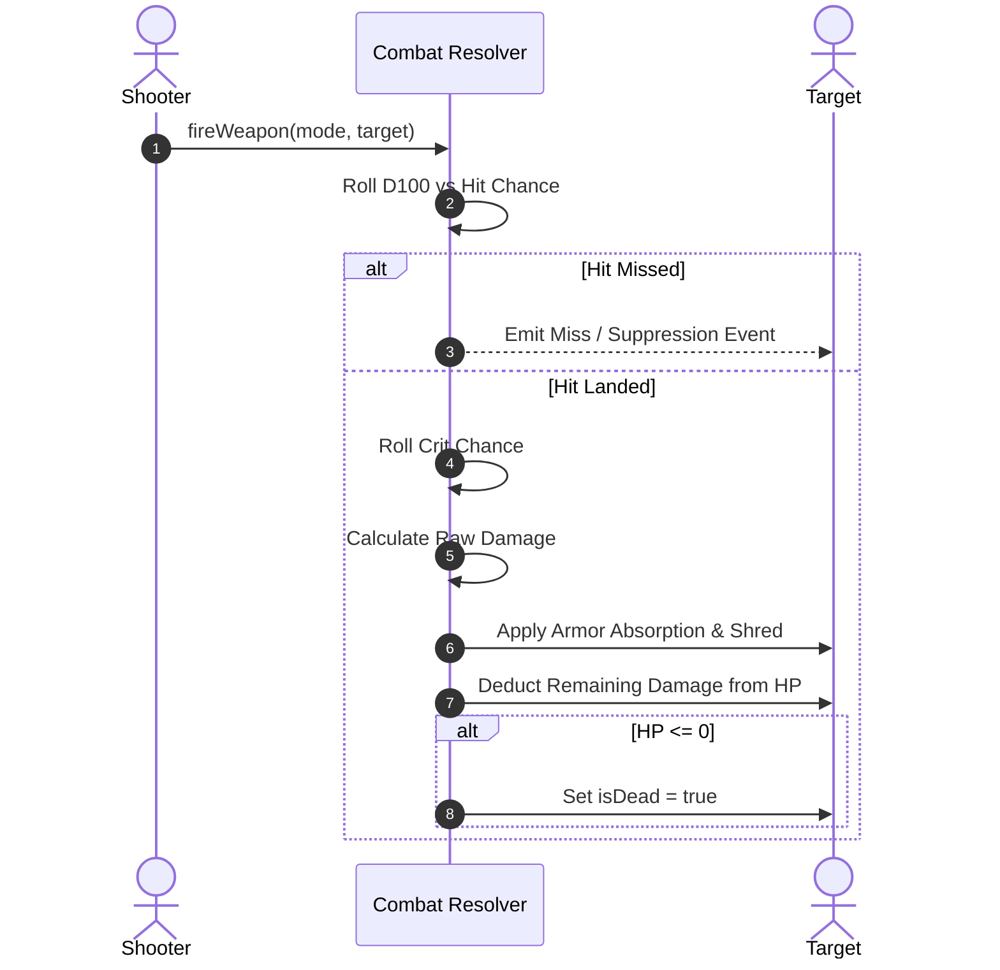

# Combat, Ballistics & Rule Engine

## 1. Line of Sight (LOS) & Visibility

Grid visibility is computed purely in 2D/3D integer coordinates using high-speed DDA ray marching (`src/core/Visibility.ts` and `src/core/Occlusion.ts`):
- **Zero Raycasting in Core**: Physics raycasting is not used for gameplay checks; raycasters are restricted to pointer input picking in `InteractionController.ts`.
- **Wall Occlusion**: Solid wall components block vision unless destroyed or low-profile.

---

## 2. Ballistic Equations & Hit Probability

### Hit Calculation
`hitChance` (`src/core/Ballistics.ts`) sums every term inside one bracket and then scales
the lot by the shot mode, so a mode multiplies the situation rather than being added to it:

$$\text{chance} = \text{clamp}\Big(\big(\text{weapon base} + \text{global} + \text{proficiency} - \text{range} - \text{cover} - \text{shooter statuses} - \text{target statuses} - \text{evasion}\big) \times \text{mode}\Big)$$

- **Range**: `distance × accuracyPerMetre`, where the per-metre figure is the weapon's own,
  scaled by the loaded round and by carried glass (`rangeFalloff`, floored at zero — gear may
  cancel falloff, never invert it). Beyond `maxRange` the chance is 0 outright.
- **Cover** (`COVER`, applied by `coverPenalty`): standing behind a crate 20, crouching in the
  open 25, crouching behind a crate 40, standing behind a wall 45, crouching behind a wall 60.
- **Proficiency**: the shooter's training with *that weapon class*, plus trait accuracy, plus
  bipod-style bonuses that apply only while crouched.
- **Evasion**: the target's, never below zero. Subtracted before the mode multiplier, so a
  hard target is hard to snap at and hard to line up on alike.
- Clamped to `AIM.min`–`AIM.max`, which is why the headline percentage is recomputed from the
  terms rather than divided back out of a mode's result.

### Critical Hit Calculation
`critBreakdown` takes the weapon's own chance — with the holder's trait bonuses already folded
in by `effectiveWeapon` — and moves it by two things:

$$\text{crit}\% = \text{clamp}\Big(w_{\text{crit}} + S \cdot b_w\big(2\tfrac{d}{R_w} - 1\big) - A \cdot \text{armour} \cdot (1 - \text{pen})\Big)$$

- **Range swing** (`CRIT.rangeSwing`, `b_w` = the weapon's `critRangeBias`): the full swing at
  either extreme of the weapon's reach and nothing at its midpoint. A shotgun's bias is -1, a
  sniper rifle's +1, a service rifle's 0.
- **Armour resistance** (`CRIT.armorResist`): only the plate a round does not punch through,
  so armour-piercing keeps its chance at the vitals where buckshot loses nearly all of it.
- **Immunity short-circuits all of it**: a target with `critImmune` yields chance 0 and a
  multiplier of 1, whatever the weapon, the distance or the roll.
- A crit multiplies the round **before** armour subtracts, so plate blunts a critical hit with
  the same flat bite it takes out of an ordinary one rather than being bypassed.

### Where a modifier comes from
A unit's effective numbers are one additive fold over four sources, none of which knows
about the others: the **character sheet** it was rolled with, **wounds** derived from its
current health, **body-worn kit** in its pockets, and **attachments fitted to the weapon in
its hands**. A weapon is an instance with a serial and a rail whose size depends on its
class, so glass follows the rifle rather than the soldier — and swapping weapon drops what
was on the old one.

#### The sheet: four attributes, every number derived
A sheet is dealt four numbers — Health, Agility, Strength, Intelligence — each rolled on the
one scale in `CHARACTER.attribute`. Nothing tactical is rolled *beside* them: `derive()`
(`src/core/Characters.ts`) reads each attribute linearly onto the band its stat lives in, the
bottom of the scale landing on the bottom of the band and the top on the top. A stat is
therefore described entirely by its two ends in `CHARACTER` and needs no curve of its own,
and a band may run backwards — `itemApDelta` does, which is how an attribute makes kit
*cheaper* as it rises.

| Attribute | Derived stats | Band in `CHARACTER` |
| --- | --- | --- |
| Health | `maxHp`, `healBonus` | `hp`, `healBonus` |
| Agility | `maxAp`, `evasion` | `ap`, `evasion` |
| Strength | `throwRange`, `carrySlots` | `throwRange`, `carrySlots` |
| Intelligence | `itemApDelta` | `itemApDelta` (runs backwards, floored at 1 AP by `itemApCost`) |

AP and evasion sharing Agility is a deliberate coupling, not a shortage of attributes: a
quick character should be both harder to line up and able to do more with a turn, so the two
move together instead of being two unrelated dice that could disagree about the same person.

`derive()` is a pure function of the attributes and of nothing else — not gear, not wounds,
not stance, which are the trait fold's business and are added on top of these. It is a
function rather than a getter, so a caller takes the result into a local once instead of
re-deriving per read.

**The wire consequence** is the load-bearing part: a sheet carries attributes, not ceilings.
Sheets arrive from a peer in the start handshake, and `sanitizeSheet` has four integers to
clamp to `CHARACTER.attribute`, plus a specialism and a trait list to recognise. A peer
cannot state a hit-point ceiling, an evasion or a carry limit *at all* — no such field exists
to send, and each side derives them from attributes it has clamped itself. The envelope is
unforgeable by construction rather than by validation: there is no absurd maximum to reject,
only a field that was never there.

Only the properties an *enemy* has to read are replicated (`TraitsComponent`: evasion, its
crouched half, crit immunity, step cost, damage taken). Everything a modifier does to its
own unit is either folded locally or already inside the numbers an attack carries, because
this side holds only a stock copy of the other squad's kit.

Current values for every trait, status, attachment and piece of kit named here live in the
generated [status and trait catalogue](../design/gdd/status-and-trait-catalog.md).

---

## 3. Damage Resolution & Armor

- **Armour absorption**: the target's armour is subtracted flat from each round, but only the
  share the round fails to penetrate — `armour × (1 - armorPen)`. Every hit still does at least
  `AIM.minDamage`, so armour can blunt a weapon and never makes a unit immune to it. That floor
  is why a piece of kit meant to survive burst fire reduces damage by a *fraction*
  (`TraitEffects.damageTaken`) rather than adding armour points: against many small rounds the
  base plate already floors them, and further points buy nothing.
- **Status and gear both pull on the same number**: `1 + statusDamageTaken + gearDamageTaken`,
  added rather than compounded, so a plated unit under a shred takes both and neither
  multiplies the other into something unintended.
- **Armour shredding**: high-penetration rounds and explosives reduce armour for the rest of
  the match.
- **Suppression**: rounds that *miss* stack `Suppressed` on the target (accuracy and points,
  per stack, pinned at the cap). It is derived on both sides rather than sent — `executeShot`
  counts the rounds that went past and `replayShot` counts the false entries in the rolls it
  was given, so no message had to grow.
- **Wounds**: `Limping` at or below half health and `Concussed` at or below a quarter, from
  `woundTraits(hp, maxHp)`. They are **derived from current health, not stamped on** when a
  threshold is crossed: hit points already replicate, so both peers reach the same answer with
  nothing sent, there is no threshold hysteresis to get wrong, and healing genuinely lifts
  them. `Winded` is a separate thing — a *status* from exhaustion, not a wound.
