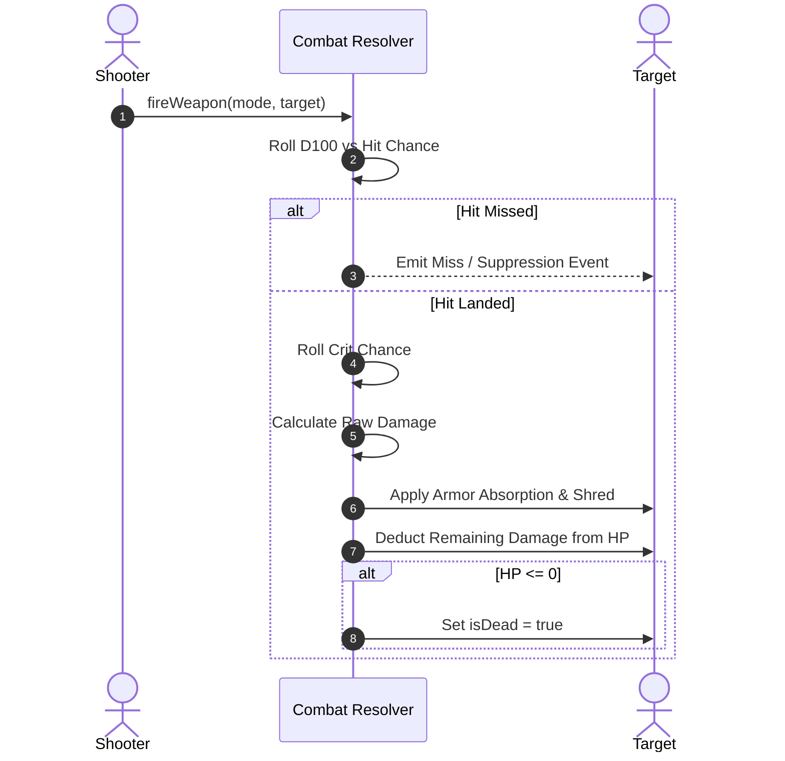

# Combat, Ballistics & Rule Engine

## 1. Line of Sight (LOS) & Visibility

Grid visibility is computed purely in 2D/3D integer coordinates using high-speed DDA ray marching (`src/core/Visibility.ts` and `src/core/Occlusion.ts`):
- **Zero Raycasting in Core**: Physics raycasting is not used for gameplay checks; raycasters are restricted to pointer input picking in `InteractionController.ts`.
- **Wall Occlusion**: Solid wall components block vision unless destroyed or low-profile.

---

## 2. Ballistic Equations & Hit Probability

### Hit Calculation: projectiles are straight lines
Every round fires one or more **projectiles**, and each is a straight line that misses by some
error `e`. It lands on a target of presented half-width `w` with probability

$$P = \frac{w^2}{w^2 + e^2}, \qquad e = (\text{sway} + \text{spread} \times d) \times \text{mode} \times \text{training}, \qquad w = \text{size} \times \text{visible} \times (1 - \text{evasion})$$

`hitChance` (`src/core/Ballistics.ts`) returns `ShotOdds`: the chance the **round** lands (any
of its projectiles), the chance one projectile does, and how many are expected to land given
the round does. Multiplication and division only, so both peers compute the same number.

- **Weapon** (`Arsenal`): `sway` (metres of error at no distance — how steady it is in the
  hands), `spread` (metres per metre — how the error grows), `pellets` (lines per round: 1 for a
  bullet, 9 for a shell), and `damage` / `armorPen` per projectile. Out of `maxRange` the chance
  is 0 outright.
- **Mode** (`SHOT_MODES[mode].spreadMul`): aimed ×0.5, snap ×1, burst ×1.1, reaction ×1.4.
- **Training**: proficiency tightens the error by `AIM.trainingTighten` per point, a status
  penalty (flashed, suppressed) widens it by the same; clamped between 0.2× and 3×. Carried
  glass and the loaded round scale `spread` only (`rangeFalloff`, `rangePenaltyMul`), floored at
  zero.
- **Target**: `AIM.targetSize` (0.3 m) × the **visible share** for its stance and the cover the
  line crosses (`COVER`: open crouched 0.55, low cover 0.6 standing / 0.33 crouched, tall cover
  0.27 / 0.14) × `1 − AIM.evasionShrink × (evasion + status defence)`. Evasion below zero is
  treated as zero. **From behind** — the shooter in the target's rear half-plane by its
  `heading` (`fromBehind`, `src/core/Facing.ts`) — evasion and status defence count for
  nothing; cover still does.
- **Clamps**: one projectile never exceeds `AIM.max`; the *round* never falls below `AIM.min`.
  A floor per pellet would make a shell at the far end of its range land a third of the time.
- **A round** lands if any projectile does. Each projectile is its own roll from the match
  stream, in order, then one crit roll if anything landed. **Armour is taken off the round once**
  — `resolveDamage(…, landed)` sums the landed projectiles first — and the minimum damage is per
  round, so buckshot is impact rather than penetration and base armour blunts it without
  zeroing it.
- **Consequence, not rule**: a shotgun's damage falls with distance because fewer pellets
  land. Calibrated so it out-damages a rifle about twofold inside a room and draws level at
  about 7 m (9 pellets × 14). The rifle, gatling and sniper were fitted to the additive model
  this replaced, within a few points at 4–20 m.
- **What a player sees** is the round's chance and its damage when it lands (for a shell, with
  the pellets expected at that distance), plus AP and rounds. `expectedRoundDamage` is the same
  estimate for the AI. Spread, pellets and crit are on the loadout screen and in the
  [catalogue](../design/gdd/status-and-trait-catalog.md).

### Critical Hit Calculation
`critBreakdown` takes the weapon's own chance — with the holder's trait bonuses already folded
in by `effectiveWeapon` — and moves it by two things:

$$\text{crit}\% = \text{clamp}\Big(w_{\text{crit}} + S \cdot b_w\big(2\tfrac{d}{R_w} - 1\big) - A \cdot \text{armour} \cdot (1 - \text{pen})\Big)$$

- **Range swing** (`CRIT.rangeSwing`, `b_w` = the weapon's `critRangeBias`): the full swing at
  either extreme of the weapon's reach and nothing at its midpoint. A shotgun's bias is -1, a
  sniper rifle's +1, a service rifle's 0.
- **Armour resistance** (`CRIT.armorResist`): only the plate a round does not punch through,
  so armour-piercing keeps its chance at the vitals where buckshot loses nearly all of it.
- **Immunity short-circuits all of it**: a target with `critImmune` yields chance 0 and a
  multiplier of 1, whatever the weapon, the distance or the roll.
- A crit multiplies the round **before** armour subtracts, so plate blunts a critical hit with
  the same flat bite it takes out of an ordinary one rather than being bypassed.

### Where a modifier comes from
A unit's effective numbers are one additive fold over four sources, none of which normally
knows about the others: the **character sheet** it was rolled with, **wounds** derived from its
current health, **body-worn kit** in its pockets, and **attachments fitted to the weapon in
its hands**. A weapon is an instance with a serial and a rail whose size depends on its
class, so glass follows the rifle rather than the soldier — and swapping weapon drops what
was on the old one.

#### The sheet: four attributes, every number derived
A sheet is dealt four numbers — Health, Agility, Strength, Intelligence — each rolled on the
one scale in `CHARACTER.attribute`. Nothing tactical is rolled *beside* them: `derive()`
(`src/core/Characters.ts`) reads each attribute linearly onto the band its stat lives in, the
bottom of the scale landing on the bottom of the band and the top on the top. A stat is
therefore described entirely by its two ends in `CHARACTER` and needs no curve of its own,
and a band may run backwards — `itemApDelta` does, which is how an attribute makes kit
*cheaper* as it rises.

| Attribute | Derived stats | Band in `CHARACTER` |
| --- | --- | --- |
| Health | `maxHp`, `healBonus` | `hp`, `healBonus` |
| Agility | `maxAp`, `evasion` | `ap`, `evasion` |
| Strength | `throwRange`, `carrySlots`, `gearRelief`, `meleeSkill`, `meleePower` | `throwRange`, `carrySlots`, `gearRelief`, `meleeSkill`, `meleePower` |
| Intelligence | `itemApDelta` | `itemApDelta` (runs backwards, floored at 1 AP by `itemApCost`) |

AP and evasion sharing Agility is a deliberate coupling, not a shortage of attributes: a
quick character should be both harder to line up and able to do more with a turn, so the two
move together instead of being two unrelated dice that could disagree about the same person.

Intelligence is read **raw as well as banded**: the band amplifies kit (`itemApDelta`), while
the attribute itself gates it — an `ItemSpec.minIntelligence` is refused by `canUse`, which is
also the predicate that greys the HUD row, and refused again inside `use` ahead of the replay
bypass, so a peer cannot make this side work kit its character cannot work.

**Beside the four attributes the sheet also carries training**, which is rolled rather than
derived: a weapon-class accuracy per class with a bonus for the one specialism, and a
`utility` percent per discipline — Medical, Demolitions, Mechanics. Physique is rolled once
and read onto bands; training is a separate axis because it is what practice moves, and it is
the field organic growth will later write to. Each discipline scales exactly one thing:
Demolitions the blast radius and armour shred of ordnance *this* character throws (stamped
into the unit's own grenade specs, so every consumer reads the thrower's real numbers),
Medical the hit points a treatment this character applies to **another** unit restores,
Mechanics the armour a repair brings back and what the repair costs in points. Utility bands
run negative as well as positive, so the untrained end of one is a penalty and not merely an
absent bonus. `sanitizeSheet` clamps utility exactly as it clamps weapon proficiency.

`derive()` is a pure function of the attributes and of nothing else — not gear, not wounds,
not stance, which are the trait fold's business and are added on top of these. It is a
function rather than a getter, so a caller takes the result into a local once instead of
re-deriving per read.

**The wire consequence** is the load-bearing part: a sheet carries attributes, not ceilings.
Sheets arrive from a peer in the start handshake, and `sanitizeSheet` has four integers to
clamp to `CHARACTER.attribute`, plus a specialism and a trait list to recognise. A peer
cannot state a hit-point ceiling, an evasion or a carry limit *at all* — no such field exists
to send, and each side derives them from attributes it has clamped itself. The envelope is
unforgeable by construction rather than by validation: there is no absurd maximum to reject,
only a field that was never there.

#### What the fold knows about where a modifier came from
The fold is **source-blind by default, with a source-aware fold beside it** rather than in
place of it. Source-blindness is the property that lets a vest and a bloodline grant the same
modifier without either knowing the other exists, and it is still what every rule reads.

- `TraitSource` is `innate | wound | gear` — three, not four, because worn kit and a fitted
  attachment are both gear and no rule has wanted to tell a vest from a scope. A `SourcedTrait`
  is an id together with its source.
- `resolveSourcedInto(out, traits, source?)` is the same fold over tagged traits, filtered to
  one source when asked. With no source it is exactly the source-blind fold. `resolveTraits` /
  `resolveTraitsInto` are unchanged and remain the default; a unit keeps a full fold and a
  gear-only fold side by side and exposes `gearOnlyTraits`.
- **One combining rule.** `addEffects` is the single place that knows how each `TraitEffects`
  field combines — numbers sum, flags OR — and both folds go through it. That is the whole
  defence against the obvious hazard of a second fold: a newly added field cannot be honoured
  by one fold and silently dropped by the other.

**Exactly one rule consumes the attribution**: `gearRelief`, a percent off Strength, cancels
that share of what *gear* does to a unit's step price and action-point ceiling. It is
deliberately narrow in three ways — gear only (a limp is not something broad shoulders undo),
penalties only (kit that helps a unit move or hands it a point is never eaten, so being strong
cannot cancel a benefit), and movement and points only (carrying the weight is not the same as
being a smaller target, so plate's evasion cost stands whoever wears it). Heavy plate costs a
point as well as speed for this rule to have anything to answer.

Only the properties an *enemy* has to read are replicated (`TraitsComponent`: evasion, its
crouched half, crit immunity, step cost, damage taken). Everything a modifier does to its
own unit is either folded locally or already inside the numbers an attack carries, because
this side holds only a stock copy of the other squad's kit.

Current values for every trait, status, attachment and piece of kit named here live in the
generated [status and trait catalogue](../design/gdd/status-and-trait-catalog.md).

---

### Melee: a blow with the sidearm
Every soldier carries a **sidearm** in its own loadout slot, beside the primary weapon
(`UnitLoadout.sidearm`, stored on `InventoryComponent` and replicated). An empty slot is
`MeleeId.Fists`. The table is `MELEE` in `src/core/Melee.ts`; numbers in the
[catalogue](../design/gdd/status-and-trait-catalog.md#5-sidearms).

- **Reach** (`canMelee`): a neighbouring tile, diagonals included, on the same level, with line
  of sight between — a solid wall on the shared edge stops a blow, a parapet does not. Points
  enough for the sidearm; no range band and no ammunition.
- **Chance** (`meleeChance`): the sidearm's own accuracy plus the attacker's Strength
  (`meleeSkill`), minus the defender's evasion and **parry** — their sidearm's plus what their
  primary weapon is worth held across them (`LONG_GUN_PARRY`: a scoped rifle is a liability).
  Status penalties apply as for a shot. No range term and **no cover term**: that absence is
  what melee is for. One draw, a contest folded into one roll.
- **From behind** (the attacker on one of the three tiles at the defender's back): no parry,
  no evasion, no status defence — only the attacker's own condition counts — and the blow's
  damage is multiplied by the sidearm's `fromBehind`: **5× for a knife**, 1× for fists and the
  club. A knife from behind kills anyone in the ordinary health band through a full plate
  carrier; a very large, plated soldier can survive a weak knifer. It is not an outright kill.
- **Damage** (`meleeWeapon` → `resolveDamage`): the same armour arithmetic as a round. Strength
  scales the blow (`meleePower`); armour penetration and shred are what separate the families —
  fists barely dent plate, a club keeps its damage through it and strips it. Crits use
  `critBreakdown` with no distance term; a club has no crit chance at all.
- **Consequences** (`executeMelee`): contact makes both units `known`; a loud sidearm sets
  `firedThisTurn` like a shot. No suppression. At most two draws from the match stream in a fixed
  order — the blow, then the crit if it landed and the weapon can crit.

**Facing is a rule quantity.** `PositionComponent.heading` is one of eight compass directions
(`HEADINGS`), set by a step (the direction walked), a shot or a blow (toward the target) and a
facing order — each worked out from tile or world offsets by comparison alone, since
`targetYaw` is a float from `atan2` and banned from rules code. It replicates and is in the
state digest. Awareness (and with it a *silent* kill) is still to come in ITEM-019; a non-lethal
knockout belongs with the campaign roster (ITEM-012).

## 3. Damage Resolution & Armor

- **Armour absorption**: the target's armour is subtracted flat from each round, but only the
  share the round fails to penetrate — `armour × (1 - armorPen)`. Every hit still does at least
  `AIM.minDamage`, so armour can blunt a weapon and never makes a unit immune to it. That floor
  is why a piece of kit meant to survive burst fire reduces damage by a *fraction*
  (`TraitEffects.damageTaken`) rather than adding armour points: against many small rounds the
  base plate already floors them, and further points buy nothing.
- **Status and gear both pull on the same number**: `1 + statusDamageTaken + gearDamageTaken`,
  added rather than compounded, so a plated unit under a shred takes both and neither
  multiplies the other into something unintended.
- **Armour shredding**: high-penetration rounds and explosives reduce armour for the rest of
  the match — unless somebody spends a turn on it. A repair kit is the only thing that undoes
  permanent loss, which is what earns it a pouch slot; it needs Intelligence to operate and a
  mechanic's training makes it both cheaper and worth more.
- **Suppression**: rounds that *miss* stack `Suppressed` on the target (accuracy and points,
  per stack, pinned at the cap). It is derived on both sides rather than sent — `executeShot`
  counts the rounds that went past and `replayShot` counts the false entries in the rolls it
  was given, so no message had to grow.
- **Wounds**: `Limping` at or below half health and `Concussed` at or below a quarter, from
  `woundTraits(hp, maxHp)`. They are **derived from current health, not stamped on** when a
  threshold is crossed: hit points already replicate, so both peers reach the same answer with
  nothing sent, there is no threshold hysteresis to get wrong, and healing genuinely lifts
  them. `Winded` is a separate thing — a *status* from exhaustion, not a wound.
