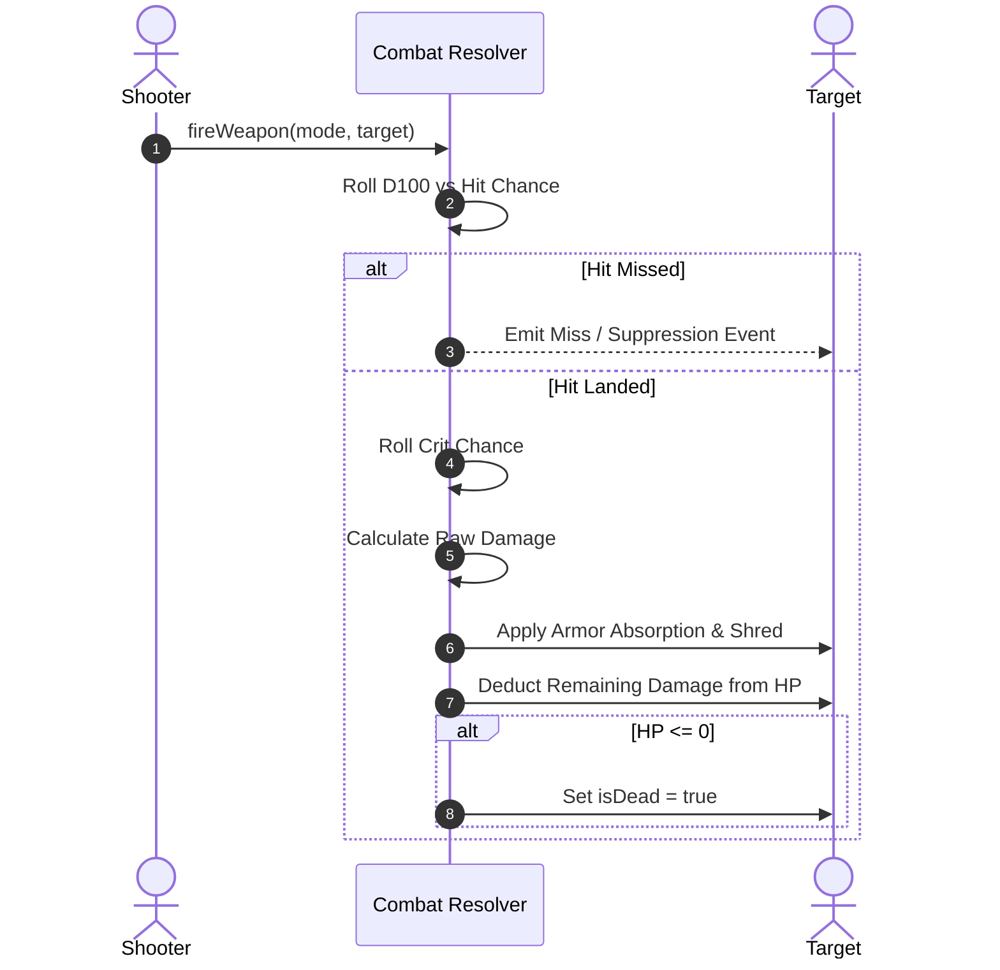

# Combat, Ballistics & Rule Engine

## 1. Line of Sight (LOS) & Visibility

Grid visibility is computed purely in 2D/3D integer coordinates using high-speed DDA ray marching (`src/core/Visibility.ts` and `src/core/Occlusion.ts`):
- **Zero Raycasting in Core**: Physics raycasting is not used for gameplay checks; raycasters are restricted to pointer input picking in `InteractionController.ts`.
- **Wall Occlusion**: Solid wall components block vision unless destroyed or low-profile.

---

## 2. Ballistic Equations & Hit Probability

### Hit Calculation
$$\text{Base Chance} = \text{Shooter Proficiency} - \text{Target Evasion} + \text{Range Modifier} - \text{Cover Penalty}$$

- **Range Modifier**: Evaluated against the weapon's configured range bands (`optimalRange`, `maxRange`, `falloffPerTile`).
- **Cover Penalty**:
  - Open: 0% evasion bonus
  - Half Cover: +15% target evasion
  - Full Cover: +30% target evasion

### Critical Hit Calculation
$$\text{Crit Chance} = \text{Weapon Base Crit} + \text{Flanking Bonus} - \text{Target Resilience}$$
$$\text{Crit Damage} = \text{Damage} \times \text{Crit Multiplier (1.3 to 2.2)}$$

---

## 3. Damage Resolution & Armor

- **Armor Absorption**: Each point of armor absorbs 1 damage up to the armor limit.
- **Armor Shredding**: High-penetration weapons and explosives reduce armor permanently.
- **Wound Trait Application**: When HP crosses below 50% or 25%, wound traits (`Winded`, `Concussed`, `Limping`) are added to the target's `TraitsComponent`.
