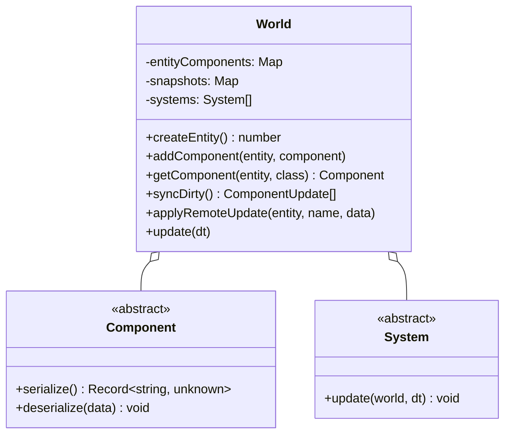

# Entity Component System (ECS) Architecture

## 1. Core Architecture

The game uses a lightweight, type-safe ECS located in `src/ecs/`.

---

## 2. Components

All entity data is stored in discrete component instances inheriting from `Component` (`src/ecs/Component.ts`):

| Component | Responsibility | Replicated? |
| --- | --- | --- |
| `IdentityComponent` | Faction (`blue` / `red`), squad index, character name | Yes |
| `PositionComponent` | Grid coordinate `(x, y)`, logical world position, target yaw | Yes |
| `HealthComponent` | Current and maximum HP. The maximum is `derive(sheet).maxHp` — read off the character's Health attribute, not stated by the sheet — with traits moving it from there | Yes |
| `ArmorComponent` | Current and maximum armour. Worn plate raises the maximum; shred takes the current down for the rest of the match, and a repair kit is the one thing that puts it back, capped at the maximum | Yes |
| `ActionPointsComponent` | Points left and the ceiling (`derive(sheet).maxAp`, from Agility, then traits, then the share of gear's AP bite Strength carries for free), plus `spentThisTurn` and `exhaustedTurns` — what a unit *used*, which is what exhaustion is judged on | Yes |
| `StanceComponent` | Crouched, moving, the route being walked, corner peek, and `firedThisTurn` — a muzzle flash gives a position away until the unit's own next turn | Yes |
| `WeaponComponent` | Equipped weapon id; the instance it clones carries the serial and the fitted rail. Only the id replicates — a peer's fitted kit shows up in the numbers they resolve, never in this side's copy | Yes (id only) |
| `AmmoComponent` | Loaded round id; clip state lives on the weapon instance | Yes |
| `InventoryComponent` | Grenades carried, by kind | Yes |
| `ItemsComponent` | Items carried, by id, including body-worn kit. Counts drop as items are spent, which is also how a peer sees a use happen. An item its carrier cannot operate still sits here — the Intelligence gate refuses the *use*, it does not empty the pouch. Weapon attachments are *not* here — a rail belongs to the weapon | Yes |
| `SightedComponent` | What the other side perceives: `seen` (fog writes it, a view mirrors it onto a mesh) and `known` (whether its *sheet* has been worked out) | Local (per-peer knowledge) |
| `TraitsComponent` | The trait-derived numbers an *enemy* must read: `evasion`, `critImmune`, `moveCostMul`. Everything a trait does to its own unit stays local or travels inside a resolved attack | Yes |
| `StatusesComponent` | Turn-decaying statuses, each with `turnsLeft` and `stacks`; absent stacks mean one, so a peer omitting the count cannot disarm a status | Yes |
| `GrenadeSpecsComponent` | Per-unit ordnance: throw range from Strength, blast radius and armour shred from the thrower's Demolitions training. Stamped into the unit's own specs rather than applied at the throw site, so the planner's preview, the range check and the debug panel all read the numbers *this* arm can reach — and a peer sees the arm it is up against rather than its own stock copy | Yes |
| `CoverRulesComponent`, `AimRulesComponent`, `MatchRulesComponent`, `StatusSpecsComponent` | Rule tables on the global entity, so both peers resolve against the same constants | Yes (global entity) |
| `WallComponent` | Wall segment state for the terrain entities | Yes |

Nothing about a character's derived stats replicates in its own right. A sheet carries four
attributes and no ceilings, and each side runs `derive()` over the attributes it holds, so the
numbers above travel only as the *resolved* state of a component the rules already had to
send — never as a ceiling a peer asserted.

Current values for every status and trait are in the generated
[status and trait catalogue](../design/gdd/status-and-trait-catalog.md).

---

## 3. Systems

Systems execute business logic across entities on each tick or action:

- **`MovementSystem`**: Steps entities along A* waypoints, deducts AP per tile, updates stance animations.
- **`CombatSystem`**: Processes shot declarations, evaluates cover/LOS, applies `WireHit` damage, shreds armor, triggers death.
- **`ItemSystem`**: Command-driven, not ticked. Applies an item's ordered effect list to a target that defaults to the user; charges the turn's price and the pouch to the *user* whoever is being worked on. The only place that knows what an effect does.
- **`TurnSystem`**: Manages round handovers, resets AP pools, decrements status durations.
- **`WallSystem`**: Updates structural integrity and occlusion of destructible barricades.
- **`RenderSystem`**: Reads component state (`PositionComponent`, `StanceComponent`) and updates corresponding 3D view representations.

---

## 4. State Replication & Dirty Diffing

Every component implements `serialize(): Record<string, unknown>` and `deserialize(data: Record<string, unknown>)`.

1. **Snapshotting**: `World.ts` maintains a snapshot map of the serialized state of every component.
2. **Diffing (`World.syncDirty()`)**: Iterates all active components, compares current serialized JSON against previous snapshot using `jsonEqual()`.
3. **Broadcast**: Emits `componentUpdate` JSON-RPC notifications for modified components.
4. **Remote Ingestion (`World.applyRemoteUpdate()`)**: Remote client unpacks data, calls `deserialize()`, and bypasses re-broadcasting via `applyingRemote` guard.
5. **Rewind (`World.snapshot(entityIds)` / `World.restore(snapshot)`)**: The
   same `serialize`/`deserialize` pair, used to record and put back a whole
   moment rather than one component. `restore` writes under the same
   `applyingRemote` guard and re-baselines the snapshot map, so a rewind is
   neither broadcast nor reported by the next `syncDirty()`. Takes named
   entities rather than all of them: spectator playback only rewinds soldiers,
   and snapshotting a map's worth of wall entities at every event would cost a
   great deal to restore terrain that nothing can change. See
   [P2P Networking §4](networking.md) for what uses it.

### Commands, and why a target on the wire can still matter

Item use is the clearest case of the split between a *command* and *replicated state*, and it
is worth being precise about, because the same message is read two different ways.

- **The command carries a target.** `useItem` gained optional `targetFaction` / `targetIndex`;
  a self-use names nobody, exactly as it did before there was anyone to name.
- **The live remote handler applies nothing.** Every consequence of a use — hit points, armour,
  action points, statuses, item counts — is component state that already replicates from the
  side that resolved it, so the receiving peer refreshes its HUD and does no arithmetic. This
  is the same reasoning as suppression and death: state a peer can already see is never also
  announced.
- **The target is load-bearing for recording and playback.** `applyRecordedCommand` *re-runs*
  the use rather than restoring state around it, so it is the one path that has to know who the
  kit was used on. A frame from before targeted use, or one naming a unit this side cannot
  resolve, replays as a self-use rather than being dropped.
- **No number travels.** Both peers hold both squads' real sheets from the `ready` handshake,
  so a trained medic's amount is derived identically on each side. The wire says *who*, not
  *how much* — and the Intelligence gate is re-checked locally regardless, because how clever a
  character is is a fact about this side's sheet, not a claim a peer gets to make.
