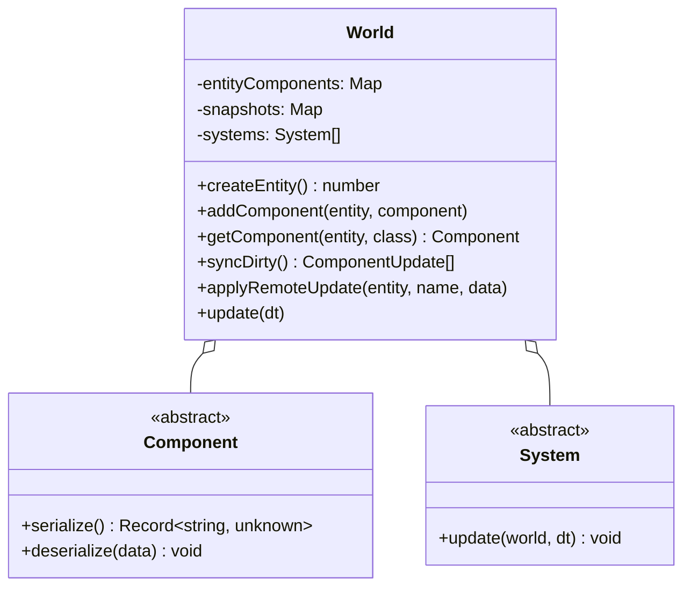

# Entity Component System (ECS) Architecture

## 1. Core Architecture

The game uses a lightweight, type-safe ECS located in `src/ecs/`.

---

## 2. Components

All entity data is stored in discrete component instances inheriting from `Component` (`src/ecs/Component.ts`):

| Component | Responsibility | Replicated? |
| --- | --- | --- |
| `IdentityComponent` | Faction (`blue` / `red`), squad index, character name | Yes |
| `PositionComponent` | Grid coordinate `(x, y)` and interpolated world vector | Yes |
| `HealthComponent` | Current HP, Max HP, and alive/dead state | Yes |
| `ArmorComponent` | Base armor, current armor, shred damage | Yes |
| `ActionPointsComponent` | Turn AP points, max AP, movement/action costs | Yes |
| `StanceComponent` | Stance (standing vs crouched), facing angle/yaw | Yes |
| `WeaponComponent` | Primary weapon spec, ammo type, range band, crit modifiers | Yes |
| `AmmoComponent` | Loaded magazine count, max capacity, reload costs | Yes |
| `TraitsComponent` | Active passive traits and wound penalties | Yes |
| `StatusesComponent` | Active turn-decaying buffs/debuffs (e.g. blinded, burning) | Yes |
| `CoverRulesComponent` | Computed cover level (none / half / full) relative to threats | Local (Derived) |

---

## 3. Systems

Systems execute business logic across entities on each tick or action:

- **`MovementSystem`**: Steps entities along A* waypoints, deducts AP per tile, updates stance animations.
- **`CombatSystem`**: Processes shot declarations, evaluates cover/LOS, applies `WireHit` damage, shreds armor, triggers death.
- **`TurnSystem`**: Manages round handovers, resets AP pools, decrements status durations.
- **`WallSystem`**: Updates structural integrity and occlusion of destructible barricades.
- **`RenderSystem`**: Reads component state (`PositionComponent`, `StanceComponent`) and updates corresponding 3D view representations.

---

## 4. State Replication & Dirty Diffing

Every component implements `serialize(): Record<string, unknown>` and `deserialize(data: Record<string, unknown>)`.

1. **Snapshotting**: `World.ts` maintains a snapshot map of the serialized state of every component.
2. **Diffing (`World.syncDirty()`)**: Iterates all active components, compares current serialized JSON against previous snapshot using `jsonEqual()`.
3. **Broadcast**: Emits `componentUpdate` JSON-RPC notifications for modified components.
4. **Remote Ingestion (`World.applyRemoteUpdate()`)**: Remote client unpacks data, calls `deserialize()`, and bypasses re-broadcasting via `applyingRemote` guard.
