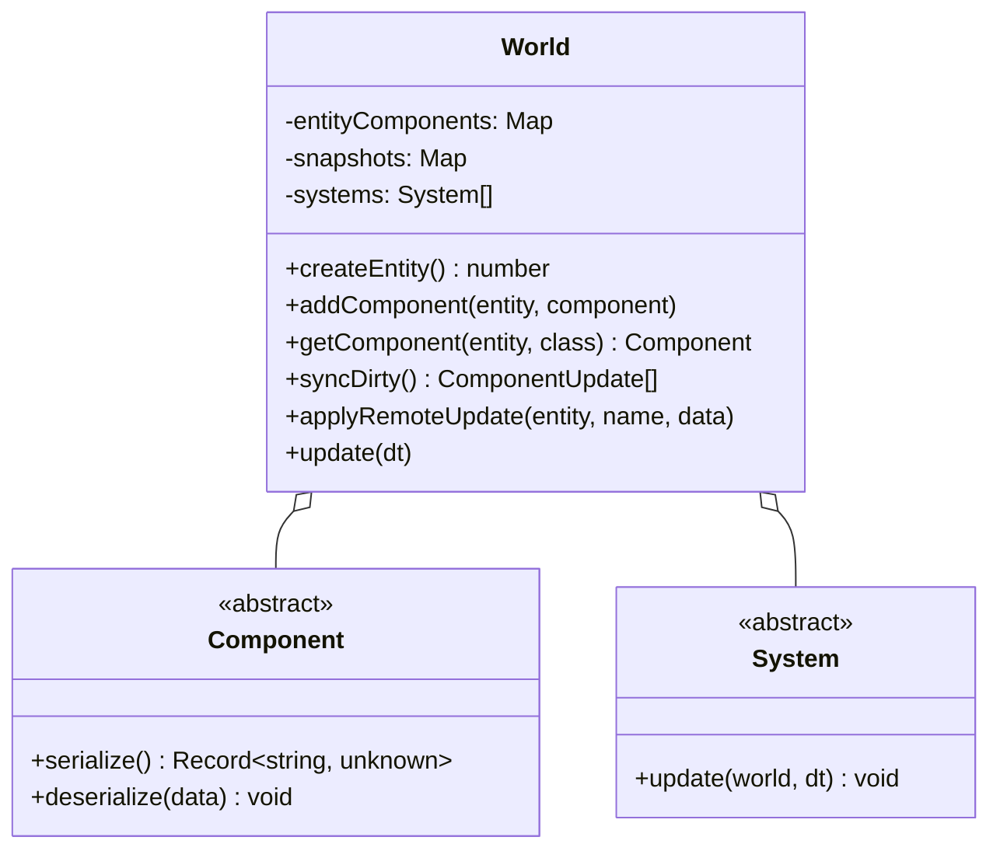

# Entity Component System (ECS) Architecture

## 1. Core Architecture

The game uses a lightweight, type-safe ECS located in `src/ecs/`.

---

## 2. Components

All entity data is stored in discrete component instances inheriting from `Component` (`src/ecs/Component.ts`):

| Component | Responsibility | Replicated? |
| --- | --- | --- |
| `IdentityComponent` | Faction (`blue` / `red`), squad index, character name | Yes |
| `PositionComponent` | Grid coordinate `(x, y)`, logical world position, target yaw | Yes |
| `HealthComponent` | Current and maximum HP. The maximum is per character, and traits move it | Yes |
| `ArmorComponent` | Current and maximum armour. Worn plate raises the maximum | Yes |
| `ActionPointsComponent` | Points left and the ceiling, plus `spentThisTurn` and `exhaustedTurns` — what a unit *used*, which is what exhaustion is judged on | Yes |
| `StanceComponent` | Crouched, moving, the route being walked, corner peek, and `firedThisTurn` — a muzzle flash gives a position away until the unit's own next turn | Yes |
| `WeaponComponent` | Equipped weapon id; the instance it clones carries the serial and the fitted rail. Only the id replicates — a peer's fitted kit shows up in the numbers they resolve, never in this side's copy | Yes (id only) |
| `AmmoComponent` | Loaded round id; clip state lives on the weapon instance | Yes |
| `InventoryComponent` | Grenades carried, by kind | Yes |
| `ItemsComponent` | Items carried, by id, including body-worn kit. Weapon attachments are *not* here — a rail belongs to the weapon | Yes |
| `SightedComponent` | What the other side perceives: `seen` (fog writes it, a view mirrors it onto a mesh) and `known` (whether its *sheet* has been worked out) | Local (per-peer knowledge) |
| `TraitsComponent` | The trait-derived numbers an *enemy* must read: `evasion`, `critImmune`, `moveCostMul`. Everything a trait does to its own unit stays local or travels inside a resolved attack | Yes |
| `StatusesComponent` | Turn-decaying statuses, each with `turnsLeft` and `stacks`; absent stacks mean one, so a peer omitting the count cannot disarm a status | Yes |
| `CoverRulesComponent`, `AimRulesComponent`, `MatchRulesComponent`, `StatusSpecsComponent`, `GrenadeSpecsComponent` | Rule tables on the global entity, so both peers resolve against the same constants | Yes (global entity) |
| `WallComponent` | Wall segment state for the terrain entities | Yes |

Current values for every status and trait are in the generated
[status and trait catalogue](../design/gdd/status-and-trait-catalog.md).

---

## 3. Systems

Systems execute business logic across entities on each tick or action:

- **`MovementSystem`**: Steps entities along A* waypoints, deducts AP per tile, updates stance animations.
- **`CombatSystem`**: Processes shot declarations, evaluates cover/LOS, applies `WireHit` damage, shreds armor, triggers death.
- **`TurnSystem`**: Manages round handovers, resets AP pools, decrements status durations.
- **`WallSystem`**: Updates structural integrity and occlusion of destructible barricades.
- **`RenderSystem`**: Reads component state (`PositionComponent`, `StanceComponent`) and updates corresponding 3D view representations.

---

## 4. State Replication & Dirty Diffing

Every component implements `serialize(): Record<string, unknown>` and `deserialize(data: Record<string, unknown>)`.

1. **Snapshotting**: `World.ts` maintains a snapshot map of the serialized state of every component.
2. **Diffing (`World.syncDirty()`)**: Iterates all active components, compares current serialized JSON against previous snapshot using `jsonEqual()`.
3. **Broadcast**: Emits `componentUpdate` JSON-RPC notifications for modified components.
4. **Remote Ingestion (`World.applyRemoteUpdate()`)**: Remote client unpacks data, calls `deserialize()`, and bypasses re-broadcasting via `applyingRemote` guard.
