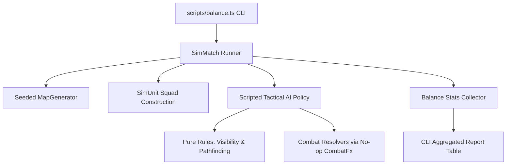

# Headless Simulation Engine & Balance Automation

## 1. Headless Simulation Architecture

The simulation engine (`src/sim/`) runs completely headless in pure TypeScript/JavaScript under Bun without browser DOM or WebGL:

---

## 2. Core Modules

- **`SimUnit` (`src/sim/SimUnit.ts`)**: Lightweight data model representing combatants with health, armor, weapon specs, ammo, AP, and position coordinates.
- **`SimMatch` (`src/sim/SimMatch.ts`)**: Manages the match lifecycle, turn order, scripted AI decision loops (movement selection, firing priority, cover usage), and win/loss resolution.
- **`Balance` (`src/sim/Balance.ts`)**: Statistical aggregator tracking win rates by faction/seed, mean turns to victory, weapon shot accuracy, damage distribution, and trait differential win rates.
- **`scripts/balance.ts`**: Command-line entry point parsing sweep parameters and formatting tabular terminal outputs.

---

## 3. Scripted AI Decision Loop

The simulated AI executes deterministic decision steps each turn:
1. **Target Selection**: Evaluates all visible enemies; ranks targets by kill probability, current HP, and hit percentage.
2. **Engagement Position**: Moves to optimal firing range band while favoring cover tiles.
3. **Action Execution**: Fires primary weapon or reloads when empty; ends turn when AP is exhausted.

---

## 4. Determinism & Seed Pinning

Simulations take a numeric seed and generate identical outcomes across runs:
- `tests/balance.test.ts` executes a pinned 50-match sweep and asserts exact win/loss numbers to guarantee rule stability during refactoring.

---

## Replaying a recorded match

`src/sim/Replay.ts` (`bun run replay <file>`) refights a recorded intent stream
through the real ECS with no engine, no canvas and nothing watching.

It exists because a recording and the wire are the same frames: an attack in a
file is an intent, exactly as it is between two peers, and the outcome is
whatever the build resolves from the match's seeded dice. So running a file is
the same exercise as *receiving* a match — which is how the receiving side gets
tested without two browsers, a signalling broker and a second pair of hands.

What it proves is narrower and stronger than a comparison: that the same intents
over the same seed produce the same world, every time. A recorded match replays
with every intent applied, twice to the same digest, and reaches the same
survivors as the match that produced it — two carriers of the same rules
(`SimUnit`s in the sweep, ECS soldiers and components in the replay), one answer.

It is not a second implementation of the rules: commands go through
`CombatSystem.fireShot`, `throwGrenade`, `MovementSystem` and `TurnManager`, the
doors a match uses. Movement is advanced at a fixed step, because a variable one
would make a replay depend on how fast the machine running it is.

## Two streams, not one

`SimMatch` draws its **dice** from `matchDice(seed)` and its **setup** — dealing
the squads — from a separate `Rng`. They shared one stream until intent-only
landed, and that made *how many numbers a sheet consumed* decide every roll
after it: adding one attribute per character once shifted every die in a
400-match sweep, and a replay (which deals nobody) began the dice where the sim
had finished dealing and resolved a different match.

A match is still one number. Its dice are a function of that number alone.
