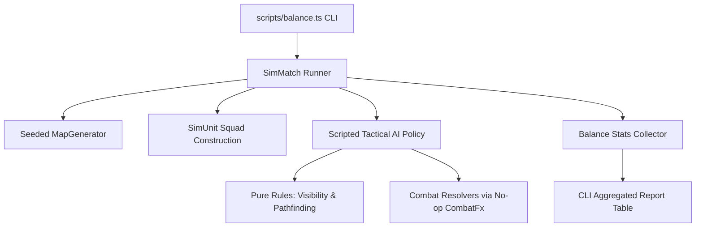

# Headless Simulation Engine & Balance Automation

## 1. Headless Simulation Architecture

The simulation engine (`src/sim/`) runs completely headless in pure TypeScript/JavaScript under Bun without browser DOM or WebGL:

---

## 2. Core Modules

- **`SimUnit` (`src/sim/SimUnit.ts`)**: Lightweight data model representing combatants with health, armor, weapon specs, ammo, AP, and position coordinates.
- **`SimMatch` (`src/sim/SimMatch.ts`)**: Manages the match lifecycle, turn order, scripted AI decision loops (movement selection, firing priority, cover usage), and win/loss resolution.
- **`Balance` (`src/sim/Balance.ts`)**: Statistical aggregator tracking win rates by faction/seed, mean turns to victory, weapon shot accuracy, damage distribution, and trait differential win rates.
- **`scripts/balance.ts`**: Command-line entry point parsing sweep parameters and formatting tabular terminal outputs.

---

## 3. Scripted AI Decision Loop

The simulated AI executes deterministic decision steps each turn:
1. **Target Selection**: Evaluates all visible enemies; ranks targets by kill probability, current HP, and hit percentage.
2. **Engagement Position**: Moves to optimal firing range band while favoring cover tiles.
3. **Action Execution**: Fires primary weapon or reloads when empty; ends turn when AP is exhausted.

---

## 4. Determinism & Seed Pinning

Simulations take a numeric seed and generate identical outcomes across runs:
- `tests/balance.test.ts` executes a pinned 50-match sweep and asserts exact win/loss numbers to guarantee rule stability during refactoring.
