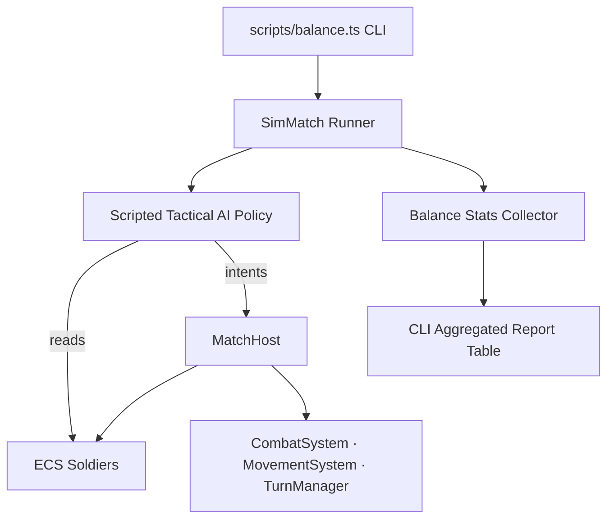

# Headless Simulation Engine & Balance Automation

## 1. Headless Simulation Architecture

The simulation engine (`src/sim/`) runs completely headless in pure TypeScript/JavaScript under Bun without browser DOM or WebGL:

---

## 2. Core Modules

- **`MatchHost` (`src/sim/MatchHost.ts`)**: The match. Real ECS soldiers and systems with no scene, advanced by intents through `CommandSystem` — the same applier the played game uses for clicks and peer messages. What the host adds is time: it steps the world at a fixed rate until every walker has arrived.
- **`SimMatch` (`src/sim/SimMatch.ts`)**: A policy and nothing else. It reads the board, decides, and hands the host an intent (`moveUnit` one tile at a time, `fireShot`, `throwGrenade`, `toggleCover`, `overwatch`, `endUnitTurn`, `endTurn`), recording each. A refused intent throws: the policy asks the rules before it acts, so a refusal is a bug.
- **`Balance` (`src/sim/Balance.ts`)**: Statistical aggregator tracking win rates by faction/seed, mean turns to victory, weapon shot accuracy, damage distribution, and trait differential win rates.
- **`scripts/balance.ts`**: Command-line entry point parsing sweep parameters and formatting tabular terminal outputs.

---

## 3. Scripted AI Decision Loop

### What the policy knows

The policy sees what a player on its side would see and nothing more
(`src/sim/Intel.ts`, one per side). It keeps a **contact** for each enemy: the tile it was last
seen on, and whether it was watching then. Seen is what fog grants: any living unit of the side
sees the tile, or the enemy fired this turn. A contact stays where it was made until that tile is
looked at and found empty, and then it is dropped: the side knows the enemy is not *there*, and
nothing about where it went. Both sides look after every intent, so an enemy walking past between
two of a side's own actions is still noticed. Sheets and kit are taken as read; position is what
hiding is about.

With no contacts a unit **searches**: it heads for the nearest ground its side has not seen,
pulled toward the middle of the map, walked by path cost rather than straight-line distance (a
goal behind a wall is a building away on foot). Ground seen three or more turns ago counts as
unseen again once everything has been looked at. A searching unit keeps a snap shot's points in
hand, and a walk that spots an enemy the side did not know about stops so the unit can choose
again knowing it.

Both of those came from measurement. Without the reserve, the side that walked into view had spent
its turn walking and the other side answered with everything, so turn order decided who found whom
and Blue won 58% of decided mirror matches; without path-cost search, 9% of matches were draws
between squads standing either side of a wall.

### The loop

Each unit, in squad order, spends its points in this order until nothing applies:

1. **Reload** if nothing its weapon can fire is loaded.
2. **Grenade** a cluster of two or more enemies that catches no friend.
3. **Shoot** if a shot of at least 50% is on offer (best expected damage per AP).
4. **Reposition**, once per turn, to where `src/sim/Tactics.ts` says. Every tile
   reachable this turn is scored in expected hit points against the side's
   *contacts*: what the unit could do from there with the points left, minus
   the reactions the route provokes (once per known watcher, at the first tile
   that watcher sees), minus what the enemies who can see the tile would do to
   it on their turn — and, at half weight, what an enemy that *cannot* see it
   yet could do after walking its points less a snap shot straight at it.
   While nothing is shootable from anywhere reachable, closing the distance
   counts instead, and counts for more with every handover in which nobody was
   hurt — two squads that each price the other's watch above a few metres of
   ground otherwise wait each other out to the turn cap. The walk is issued one
   tile per intent, so a reaction can interrupt it, and so can spotting an
   enemy (the unit then chooses again).
5. **Shoot** the best poor shot, if any.
6. **Reload** at half a magazine, **get low** when hurt, and **go on watch**
   with whatever is left.

Watching is last on purpose. An earlier version held a watch in place of a poor
shot, and a side that was forbidden to watch (`--blueWatch=off`) then won
*more* often — the policy was spending points on watches that rarely paid.
Watched only with points that would otherwise be wasted, the ability is worth
a few points of win rate to the side that has it.

---

### Ground covered

`bun run balance` reports how much of the map each side used (`src/sim/Ground.ts`), by side
and by result: tiles walked, distinct tiles stood on and their share of the walkable map, and
the mean over units of the furthest each got **forward** (along the line from its own spawn
centroid to the enemy's) and **sideways** (perpendicular to it). Win rates cannot say how a
fight was fought; this can.

First reading (2026-09-19, three disjoint blocks of 400, stock mirror; maps 36 tiles wide,
spawn centroids ~29 tiles apart, ~1270 walkable tiles):

| | walked | tiles | map | forward | sideways |
| --- | --- | --- | --- | --- | --- |
| blue (moves first) | 64.5 | 53 | 4.2% | 13.7 | 3.4 |
| red | 45.0 | 40 | 3.1% | 9.1 | 3.4 |
| winners | 56 | 48 | 3.8% | 11.5 | 3.6 |
| losers | 53 | 45 | 3.5% | 11.2 | 3.2 |

- **Head-on**: units go four times as far forward as sideways, and a squad touches about 4%
  of the map. Nothing in the policy rewards a lateral route before contact: exposure only
  counts enemies that can *already* see a tile, so an approach out of sight is free whatever
  shape it is, and closing is scored by straight-line distance.
- **The first mover does the closing**: Blue walks 43% more and gets 50% further forward, then
  ends its turn where Red can see it. Red — standing, shooting first — wins about 60% of mirror
  matches. Winners and losers barely differ in ground, so it is not *how much* a side moves
  that loses, but being the side that walks into view.

**After pricing next-turn reach** (same blocks, edge deployment, wins summed): blue 568, red
579, draws 53 — even, where it was 550 / 611 before. Units reach ~7 tiles sideways (from ~4) and
a squad uses ~6.3% of the map (from 4.4%) and walks ~120 tiles a match (from 69); matches run
longer (median 7 turns, from 5). And ground now separates results: winners walk ~121 tiles to
losers' ~102, where before the two were the same. A second term — scoring an approach by the
cover the target would have against it — was measured alongside and dropped: alone it moved
neither ground nor result, and together with this one it only skewed the split to Blue.

**Knowing only what it has seen** (2026-09-24, same blocks, edge deployment, wins summed): blue
608, red 563, draws 29, from 575 / 583 / 42 omniscient. On block 1000: watches pay — **3.1
reactions fired a match, from 0.95** — because a side no longer routes around watchers it has
not seen; units walk less (~100 tiles a match, from ~125) and range a little less sideways (7.1 /
6.5 tiles, from 7.6 / 7.8); matches are a turn shorter (median 7, from 8). The sweep takes ~36 s
a block, from ~20, most of it walking-cost fields for the search.

**Attacks from behind** (2026-09-24, same blocks): mirror 598 / 570 / 32. On block 1000, 12.6%
of shots come from the target's rear half-plane. With knives in Blue's sidearm slot, 112 of 150
blows land from behind and 89 of 101 knife kills are from behind — the policy prices a rear
tile above a front one through the contact's last known heading — but the knife squad's wins
do not move (201 / 183 against 204 / 181 before), because a blow happens in fewer than half of
matches at all.

**Noise** (2026-09-24, same blocks): mirror 595 / 569 / 36, unchanged. The policy hears what
its units hear (`Intel.hear`, roughly where) and, with no contacts, goes to look at the most
recent noise from this turn or the last before it searches unseen ground. On block 1000 the two
sides between them hear about 25 noises a match — 9.4 standing steps, 15 shots, one frag,
almost never a crouched step — of which 1.9 arrive while the hearing side has no contact at
all; that is the only time the policy acts on one, which is why nothing moved. Four
suppressors against stock: 212 / 175, from 213 / 176 before noise. Noise has no rule
consequence yet; awareness is what will give it one.

**Indoors** (`isIndoors`: a roof slab over the tile's floor; rooftops and courtyards are
outside) is 18.7% of a map's walkable ground. The ground table reports the share of tiles
walked indoors and the share of unit-turns *ended* indoors; the weapon table reports each
weapon's mean shot distance, share of shots fired from indoors, and damage per shot from inside
and outside. First reading (blocks 1000 and 5000): units walk 13–16% of their tiles indoors and
end 22–26% of their turns there — roughly in proportion, with no difference between winners and
losers. Every weapon does *worse* from indoors (rifle ~37 damage a shot against ~50 outside,
shotgun ~14 against ~22), and the shotgun already fights closest (6 m mean). Its problem is not
where it is taken: at 6 m/metre of falloff from 95 it is less accurate than a rifle (3/metre
from 85) beyond 3.3 m, and its 0.05 armour penetration gives most of its 85 damage to plate.

### Another battlefield

`generateMap(seed, { size, spawns })` takes a size (the furniture — buildings, wall runs, crate
clusters — scales with the area, so a bigger map is not an emptier one) and a deployment:
`edge` (each squad anywhere along its own edge, drawn from the map's seeded `Rng`) or `centre`
(squads facing each other across the middle with a few tiles of jitter). **`edge` is the game's
layout since 2026-09-19**, on the measurement below; `centre` remains so the question can still
be asked (`--spawns=centre`). `bun run balance -- --mapSize=72 --spawns=edge`. The options travel in a
recording's `header.map`, because the same seed under other options is another map; absent
means default, and a value this build does not know refuses the file.

Measured 2026-09-19, three disjoint blocks of 400, stock mirror (wins summed over the blocks):

| Layout | Blue | Red | Draws | Median turns | Forward b/r | Sideways b/r | Sweep time |
| --- | --- | --- | --- | --- | --- | --- | --- |
| 36, centre (the game until 2026-09-19) | 445 | 723 | 32 | 4 | 13.7 / 9.1 | 3.4 / 3.4 | 13 s |
| 36, edge (the game since) | 550 | 611 | 39 | 5 | 14.7 / 10.4 | 4.2 / 3.9 | 13 s |
| 72, centre | 581 | 510 | 109 | 7 | 31.8 / 28.0 | 5.1 / 4.9 | 45 s |
| 72, edge | 520 | 531 | 149 | 7–8 | 33.9 / 30.8 | 6.1 / 5.9 | 47 s |

- **Most of the second mover's edge is geometry, not the rules.** Squads that start ~29 tiles
  apart, facing each other, with 14 tiles of sight and 10–14 action points, meet on the first
  mover's walk every time: Blue closes, stops in view, Red shoots first. Offset the squads or
  lengthen the approach and who blunders into view first stops being decided by turn order —
  the gap shrinks from 278 wins to 61 with edge deployment alone, and is gone at 72 tiles with
  edge deployment.
- **The policy is still head-on.** Sideways reach grows with the map but stays about a sixth of
  the forward reach, and a squad uses ~2% of a 72-tile map. The bigger map evens the result
  without changing how the fight is fought.
- **Draws triple at 72 tiles** (11–13% of matches hit the 40-turn cap), and the sweep takes 3.5×
  as long.

## 4. Determinism & Seed Pinning

Simulations take a numeric seed and generate identical outcomes across runs:
- `tests/balance.test.ts` executes a pinned 50-match sweep and asserts exact win/loss numbers to guarantee rule stability during refactoring.

---

## Replaying a recorded match

`src/sim/Replay.ts` (`bun run replay <file>`) refights a recorded intent stream
through the real ECS with no engine, no canvas and nothing watching.

It exists because a recording and the wire are the same frames: an attack in a
file is an intent, exactly as it is between two peers, and the outcome is
whatever the build resolves from the match's seeded dice. So running a file is
the same exercise as *receiving* a match — which is how the receiving side gets
tested without two browsers, a signalling broker and a second pair of hands.

What it proves is narrower and stronger than a comparison: that the same intents
over the same seed produce the same world, every time. A recorded match replays
with every intent applied, twice to the same digest, and reaches the same
survivors as the match that produced it. The sweep and the replay run the same
engine, so that agreement is the file checking itself: everything the policy did
is in the recording, in order.

It is not a second implementation of the rules: commands go through
`CombatSystem.fireShot`, `throwGrenade`, `MovementSystem` and `TurnManager`, the
doors a match uses. Movement is advanced at a fixed step, because a variable one
would make a replay depend on how fast the machine running it is.

## Two streams, not one

`SimMatch` draws its **dice** from `matchDice(seed)` and its **setup** — dealing
the squads — from a separate `Rng`. They shared one stream until intent-only
landed, and that made *how many numbers a sheet consumed* decide every roll
after it: adding one attribute per character once shifted every die in a
400-match sweep, and a replay (which deals nobody) began the dice where the sim
had finished dealing and resolved a different match.

A match is still one number. Its dice are a function of that number alone.

## One engine, not two

Until ITEM-030 the sweep ran on its own copy of the soldier (`SimUnit`) and its
own turn loop, written when a soldier could not exist without a scene. That
stopped being true a day later (ITEM-001) and the copy stayed. Replaying sweep
matches through `MatchHost` and comparing state intent by intent found it had
drifted in four places — wounds cost it no action points, it settled a handover
in the opposite order, walking never counted toward exhaustion on the ECS side,
and the host never settled a turn at all. None broke a test; each moved every
balance number a little. The sweep now drives `MatchHost`, so a balance number
is a measurement of the game by construction, at the same speed (~7 s per 400
matches).
