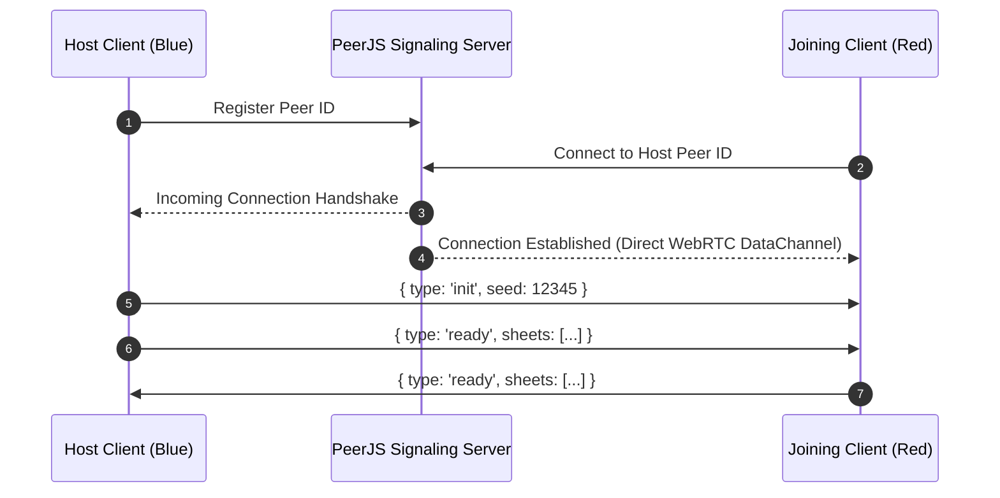

# P2P Networking & JSON-RPC Wire Protocol

## 1. Network Topology

Matches connect peer-to-peer via **PeerJS** WebRTC DataChannels:



---

## 2. Wire Protocol: JSON-RPC 2.0 Notifications

All messages over the WebRTC DataChannel use JSON-RPC 2.0 frames (`src/game/JsonRpc.ts`):

```json
{
  "jsonrpc": "2.0",
  "method": "networkMessage",
  "params": {
    "type": "fireShot",
    "shooterFaction": "blue",
    "shooterIndex": 0,
    "targetFaction": "red",
    "targetIndex": 1,
    "mode": "snap",
    "rolls": [true],
    "hits": [
      {
        "faction": "red",
        "index": 1,
        "damage": 24,
        "armorShred": 1,
        "status": null,
        "crit": false
      }
    ]
  }
}
```

---

## 3. Message Categories

### 1. Match Lifecycle
- `init`: Transmits match seed and map parameters.
- `ready`: Transmits sanitized `CharacterSheet[]` rosters.
- `endTurn`: Hands over turn priority to the opposing faction.

### 2. Player Tactical Actions (`NetworkMessage`)
- `moveUnit`: Transmits starting faction, squad index, and waypoint array `{x, y}[]`.
- `fireShot`: Transmits shooter/target coordinates, shot mode, hit rolls, and resolved `WireHit[]`.
- `throwGrenade`: Transmits grenade type, target tile, radius, and resulting `WireHit[]`.
- `reload` / `toggleCover` / `useItem`: Replicates immediate unit ability triggers.

### 3. Component Dirty State Synchronization
- `componentUpdate/<EntityId>/<ComponentName>`: Emitted by `World.syncDirty()` to synchronize mutated component state across peers without transmitting whole entity objects.
