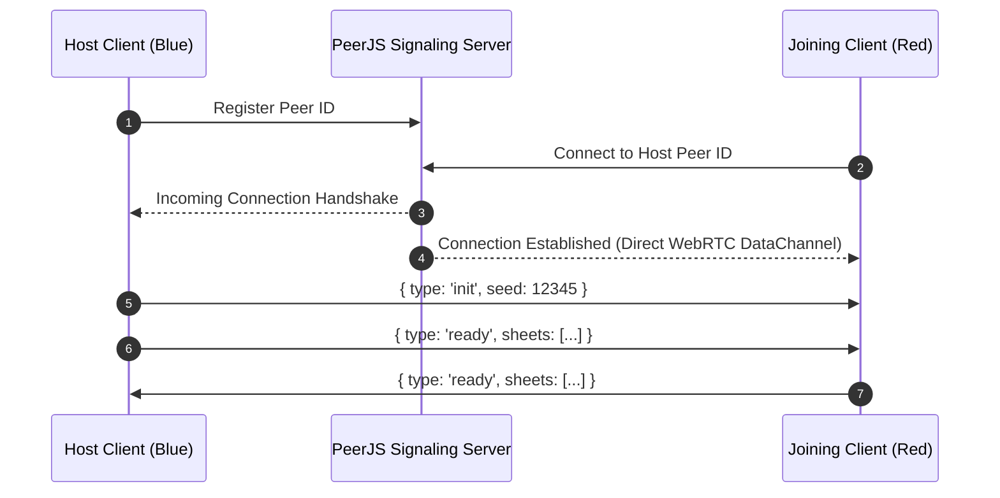

# P2P Networking & JSON-RPC Wire Protocol

## 1. Network Topology

Matches connect peer-to-peer via **PeerJS** WebRTC DataChannels:



---

## 2. Wire Protocol: JSON-RPC 2.0 Notifications

All messages over the WebRTC DataChannel use JSON-RPC 2.0 frames (`src/game/JsonRpc.ts`).
A command carries what a player **decided**, never what it produced:

```json
{
  "jsonrpc": "2.0",
  "method": "tictac/system/combat/fireShot",
  "params": {
    "type": "fireShot",
    "shooterFaction": "blue",
    "shooterIndex": 0,
    "targetFaction": "red",
    "targetIndex": 1,
    "mode": "snap"
  }
}
```

That is the whole frame. There are no dice in it and no damage: both peers
resolve the shot through the same rules, from one seeded stream per match,
against state they both hold. See
[ADR-0004](../design/adr/0004-full-knowledge-lockstep.md) for why, and
[ADR-0003](../design/adr/0003-p2p-jsonrpc-replication.md) for what it replaced.

### What intent-only demands in return

- **Only the rules may draw from the match stream** (`matchDice(seed)`), and
  both sides must draw the same numbers in the same order. Setup — dealing
  squads — and presentation — a tracer's scatter, a puff of smoke — take their
  own randomness, because a draw from the match stream moves every later roll
  in the match and a peer cannot know how many sparks the other side drew.
  Enforced by `tests/determinism.test.ts`.
- **No float two engines may disagree about can feed a decision.** `Math.hypot`
  and `Math.atan2` are refused in the rules layers: `sqrt` is correctly rounded
  by IEEE 754 and those two are implementation-defined. `distance()` and
  `facingYaw()` in `src/core/math.ts` replace them; a facing is quantised
  because it is replicated *and* digested.
- **Identical entity ids.** A command addresses a unit by faction and slot, but
  a component update and a digest address it by entity id.

---

## 3. Message Categories

### 1. Match Lifecycle
- `hello` / `init`: the joiner states its build, the host answers with the seed
  and its own. Mismatched builds refuse to *start* — see §5.
- `ready`: transmits sanitized `CharacterSheet[]` rosters.
- `endTurn`: hands over turn priority to the opposing faction.
- `digest`: a fingerprint of the sender's whole world, sent immediately before
  it hands over. Not a command: it asks the other side to do nothing.

### 2. Player Tactical Actions (`NetworkMessage`)
- `moveUnit`: faction, squad index, and waypoint array `{x, y}[]`.
- `fireShot`: shooter, target, and shot mode. Nothing else.
- `throwGrenade`: thrower, grenade kind, and the aimed tile.
- `meleeAttack`: attacker and target. The sidearm is known to both sides from the loadout.
- `overwatch`: the unit going on watch. Reactions it provokes are never sent; both peers
  resolve them from the mover's `moveUnit`.
- `reload` / `toggleCover` / `useItem`: the intent to use an ability, with
  `useItem` naming a target when the kit is being used on somebody else.

### Applying a peer's commands
Incoming commands are not applied on arrival. `handleRemoteNetworkMessage`
puts them in `CommandSystem`'s queue, which drains only while no unit is
walking: the network delivers a move and the shot after it long before this
side has animated the move, and a shot resolved mid-walk is resolved from a
tile the sender never stood on. A peer's `digest` is queued behind its commands
with `whenSettled`, because it fingerprints the world *after* them.
`tests/commands.test.ts` enqueues whole recorded matches at once, ticks at
uneven frame rates, and requires the replay's final digest; with the gate
removed, the peer's shots are refused.

### 3. Component Dirty State Synchronization
- `componentUpdate/<EntityId>/<ComponentName>`: emitted by `World.syncDirty()`
  for state the sender is authoritative for. Both sides now simulate, so
  ownership decides who may transmit what: `bindWorld` takes a predicate, each
  peer sends only its own faction's units, and an inbound update for an entity
  this side owns is dropped. Without that, two simulating peers would overwrite
  each other mid-step.

## 4. Agreement, and what happens when it fails

With no outcomes on the wire, nothing about an attack can arrive *wrong* — but
two peers can still drift apart, and nothing about a single action would reveal
it. The check is therefore about state rather than about messages:

- **A state digest at every handover** (`src/game/StateDigest.ts`). Soldiers are
  hashed per component, so a mismatch names the unit and the component;
  everything else folds into one number for terrain and one for the rule tables,
  because there are hundreds of wall entities and a hash per wall per turn would
  be paying every turn for a report nobody has needed.
- **A faked die is no longer a lie.** Dice come from the stream in an order the
  rules fix, so a client that rolls differently does not get a better outcome —
  it gets a different world, which the next digest reports.
- **Detection, not attribution.** Two peers can see that they disagree; neither
  can prove which is wrong. That is what the referee in `ITEM-025` adds, and why
  a foul aborts only in a refereed match.

## 5. Refusing a peer this build cannot agree with

`src/version.ts` states a hand-maintained `PROTOCOL_VERSION` and a `BUILD_ID`
injected at build time from the commit. Both first frames carry them — the
host's `init` and the joiner's `hello` — and a mismatch refuses the connection
with prose the join screen shows.

This is a precondition rather than hygiene: the project deploys on every push,
so two peers on different bundles diverge for entirely innocent reasons. Turning
that into a connection error with a stated cause is what stops it becoming a
foul with a wronged party once divergence is grounds for naming a side.

## 6. Combat Recording & Spectator Playback

A recording *is* the wire command stream, written down — the same frames,
verbatim. Nothing is invented for it and nothing is resolved in it: an attack in
a file is an intent, and playback works out what it did from the match's seed.

Which means running a file is the same exercise as receiving a match, and that
is how the receiving side gets tested without two browsers and a signalling
broker: `src/sim/Replay.ts` and `bun run replay <file>`.

- **Format** (`src/game/Recording.ts`): `{ header, events[] }`, version
  `RECORDING_VERSION = 2` (bumped when edge deployment became the game's layout: the same
  seed now builds a different map, so a version-1 file is refused rather than refought on
  terrain it was never fought on). The header carries `seed`, both squads'
  `CharacterSheet[]` and both squads' `SquadLoadout`. Terrain is *not* stored —
  it is regenerated by `generateMap(seed, header.map)`, so a forty-turn match is ~15 KB.
  Each event is `{ seq, turn, faction, command: NetworkMessage }`. `init` and
  `ready` are dropped: they describe the session, not the fight.
- **Capture, live**: the controller's recorder is fed by
  `CommandSystem.onApplied`, so a file holds every command the world applied
  from *either* side. Until ITEM-031 it was tapped inside `NetworkManager.send`,
  which only ever saw this side's commands: a recorded online match held one
  player's moves and none of the opponent's. Armed from the debug panel's
  **Recording** group, and only before the match
  issues its first command — a stream that does not begin at the opening
  position cannot be replayed, because playback rebuilds state by re-running
  the rules over the commands from the start.
- **Capture, headless**: `SimMatch` takes `record: true` and emits the same
  commands from its decision points. `bun run balance -- --record=<dir>` writes
  one file per simulated match via `SweepOptions.onMatch`; the sweep itself
  stays pure, and the file I/O lives in `scripts/balance.ts`.
- **Playback**: `startPlayback` in `src/main.ts` builds a match with no
  `NetworkManager`, equips both sides from the header, sets
  `InteractionController.spectating` (reveals the whole field, takes input off
  the units) and feeds commands to `applyRecordedCommand`, which is
  `CommandSystem.apply(command, 'record')` — the same door as the player's own
  clicks and a peer's messages, so a replay exercises the path a live match
  takes.
- **What the rules make a broken unit do** (`rules` origin, ITEM-014) is not in any file:
  playback applies the handover and the rules run the unit again. `Playback` waits on
  `InteractionController.busy` — walking, or the applier's queue not yet empty — before the next
  event, and a restored frame clears the queue, which was about the moment being left.
- **Stepping back** is not replay: no command is invertible. `Playback` keeps a
  `World.snapshot()` of the soldier entities at every event boundary and
  `World.restore()`s one, which suppresses echoes and re-baselines the dirty
  diff exactly as `applyRemote` does. Walls are excluded — no recorded command
  can change one.
