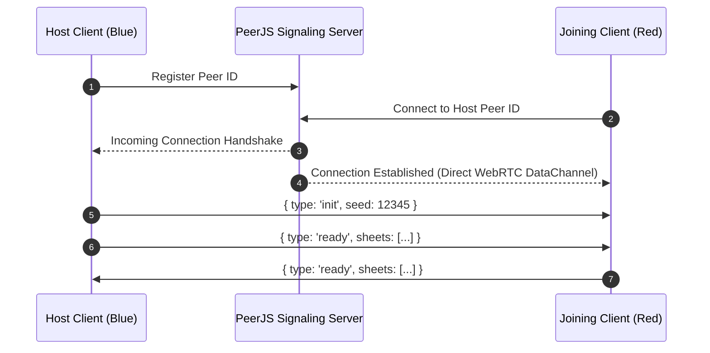

# P2P Networking & JSON-RPC Wire Protocol

## 1. Network Topology

Matches connect peer-to-peer via **PeerJS** WebRTC DataChannels:



---

## 2. Wire Protocol: JSON-RPC 2.0 Notifications

All messages over the WebRTC DataChannel use JSON-RPC 2.0 frames (`src/game/JsonRpc.ts`):

```json
{
  "jsonrpc": "2.0",
  "method": "networkMessage",
  "params": {
    "type": "fireShot",
    "shooterFaction": "blue",
    "shooterIndex": 0,
    "targetFaction": "red",
    "targetIndex": 1,
    "mode": "snap",
    "rolls": [true],
    "hits": [
      {
        "faction": "red",
        "index": 1,
        "damage": 24,
        "armorShred": 1,
        "status": null,
        "crit": false
      }
    ]
  }
}
```

---

## 3. Message Categories

### 1. Match Lifecycle
- `init`: Transmits match seed and map parameters.
- `ready`: Transmits sanitized `CharacterSheet[]` rosters.
- `endTurn`: Hands over turn priority to the opposing faction.

### 2. Player Tactical Actions (`NetworkMessage`)
- `moveUnit`: Transmits starting faction, squad index, and waypoint array `{x, y}[]`.
- `fireShot`: Transmits shooter/target coordinates, shot mode, hit rolls, and resolved `WireHit[]`.
- `throwGrenade`: Transmits grenade type, target tile, radius, and resulting `WireHit[]`.
- `reload` / `toggleCover` / `useItem`: Replicates immediate unit ability triggers.

### 3. Component Dirty State Synchronization
- `componentUpdate/<EntityId>/<ComponentName>`: Emitted by `World.syncDirty()` to synchronize mutated component state across peers without transmitting whole entity objects.

## 4. Combat Recording & Spectator Playback

A recording is the wire command stream, written down. Nothing is invented for
it: under the sender-resolved contract every attack already travels with its
dice (`WireHit[]`, `ShotResult.rolls`), so the stream is a complete account of a
fight and the peer-replay path is already a replay engine.

- **Format** (`src/game/Recording.ts`): `{ header, events[] }`, version
  `RECORDING_VERSION = 1`. The header carries `seed`, both squads'
  `CharacterSheet[]` and both squads' `SquadLoadout`. Terrain is *not* stored —
  it is regenerated by `generateMap(seed)`, so a forty-turn match is ~15 KB.
  Each event is `{ seq, turn, faction, command: NetworkMessage }`. `init` and
  `ready` are dropped: they describe the session, not the fight.
- **Capture, live**: `NetworkManager.recorder` is tapped inside `send()`,
  *before* the local-mode return, so local-versus matches record everything.
  Armed from the debug panel's **Recording** group, and only before the match
  issues its first command — a stream that does not begin at the opening
  position cannot be replayed, because playback rebuilds state by re-running
  the rules over the commands from the start.
- **Capture, headless**: `SimMatch` takes `record: true` and emits the same
  commands from its decision points. `bun run balance -- --record=<dir>` writes
  one file per simulated match via `SweepOptions.onMatch`; the sweep itself
  stays pure, and the file I/O lives in `scripts/balance.ts`.
- **Playback**: `startPlayback` in `src/main.ts` builds a match with no
  `NetworkManager`, equips both sides from the header, sets
  `InteractionController.spectating` (reveals the whole field, takes input off
  the units) and feeds commands to `applyRecordedCommand`. That is
  `handleRemoteNetworkMessage` plus the two commands a peer receives by
  replication instead — `reload` and `useItem` — which a replay must run
  locally because it has no peer to replicate from.
- **Stepping back** is not replay: no command is invertible. `Playback` keeps a
  `World.snapshot()` of the soldier entities at every event boundary and
  `World.restore()`s one, which suppresses echoes and re-baselines the dirty
  diff exactly as `applyRemote` does. Walls are excluded — no recorded command
  can change one.
