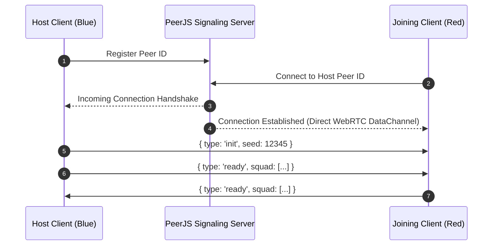

# P2P Networking & JSON-RPC Wire Protocol

## 1. Network Topology

Matches connect peer-to-peer via **PeerJS** WebRTC DataChannels:


```mermaid
sequenceDiagram
    autonumber
    participant Host as Host Client (Blue)
    participant PeerJS as PeerJS Signaling Server
    participant Join as Joining Client (Red)

    Host->>PeerJS: Register Peer ID
    Join->>PeerJS: Connect to Host Peer ID
    PeerJS-->>Host: Incoming Connection Handshake
    PeerJS-->>Join: Connection Established (Direct WebRTC DataChannel)
    Host->>Join: { type: 'init', seed: 12345 }
    Host->>Join: { type: 'ready', squad: [...] }
    Join->>Host: { type: 'ready', squad: [...] }
```

---

## 2. Wire Protocol: JSON-RPC 2.0 Notifications

All messages over the WebRTC DataChannel use JSON-RPC 2.0 frames (`src/game/JsonRpc.ts`).
A command carries what a player **decided**, never what it produced:

```json
{
  "jsonrpc": "2.0",
  "method": "tictac/system/combat/fireShot",
  "params": {
    "type": "fireShot",
    "shooterFaction": "blue",
    "shooterIndex": 0,
    "targetFaction": "red",
    "targetIndex": 1,
    "mode": "snap"
  }
}
```

That is the whole frame. There are no dice in it and no damage: both peers
resolve the shot through the same rules, from one seeded stream per match,
against state they both hold. See
[ADR-0004](../design/adr/0004-full-knowledge-lockstep.md) for why, and
[ADR-0003](../design/adr/0003-p2p-jsonrpc-replication.md) for what it replaced.

### What intent-only demands in return

- **Only the rules may draw from the match stream** (`matchDice(seed)`), and
  both sides must draw the same numbers in the same order. Setup — dealing
  squads — and presentation — a tracer's scatter, a puff of smoke — take their
  own randomness, because a draw from the match stream moves every later roll
  in the match and a peer cannot know how many sparks the other side drew.
  Enforced by `tests/determinism.test.ts`.
- **No float two engines may disagree about can feed a decision.** `Math.hypot`
  and `Math.atan2` are refused in the rules layers: `sqrt` is correctly rounded
  by IEEE 754 and those two are implementation-defined. `distance()` and
  `facingYaw()` in `src/core/math.ts` replace them; a facing is quantised
  because it is replicated *and* digested.
- **Identical entity ids.** A command addresses a unit by faction and slot, but
  a component update and a digest address it by entity id.

---

## 3. Message Categories

### 1. Match Lifecycle
- `hello` / `init`: the joiner states its build, the host answers with the seed
  and its own. Mismatched builds refuse to *start* — see §5. The host answers
  **every** `hello`, not only the first thing it says: on a data channel the
  opponent is already there when the match opens, but on a socket to a referee
  the host opens the match and the opponent connects whenever they like, and a
  referee relays live rather than replaying for a latecomer. An `init`
  announced into an empty room is gone, so a `hello` makes the host restate
  both its opening and, if it has already deployed, its `ready` — neither is
  an event, and neither is recorded, so saying them twice costs nothing.
- `ready`: one `Deployment[]` (`ITEM-043`) — a sanitized `CharacterSheet`, the
  kit this side equipped (absent if this build could not read one), and a
  session-state bag per soldier, `{ hp?, fatigue? }`. `hp` is present only on
  a match server that keeps HP, read off `GET /api/roster` and never invented
  by either side. Before `ITEM-043` these travelled as three separate
  same-length arrays (`sheets`, `loadout`, `hp`) with nothing tying their
  lengths together — exactly the failure `ITEM-041` found.
- `endTurn`: hands over turn priority to the opposing faction.
- `retreat`: the faction only (protocol 4, `ITEM-051`). The side tries to get out; whether it
  does is rolled from the match's dice on every side, and a failed attempt hands over without
  an `endTurn` of its own. Like `endTurn`, a `digest` is sent just before it.
- `digest`: a fingerprint of the sender's whole world, sent immediately before
  it hands over. Not a command: it asks the other side to do nothing.

### 2. Player Tactical Actions (`NetworkMessage`)
- `moveUnit`: faction, squad index, and waypoint array `{x, y}[]`.
- `fireShot`: shooter, target, and shot mode. Nothing else.
- `throwGrenade`: thrower, grenade kind, the aimed tile and the storey aimed at (`targetLevel`: a roofed tile is a room or its roof).
- `meleeAttack`: attacker and target. The sidearm is known to both sides from the loadout.
- `overwatch`: the unit going on watch. Reactions it provokes are never sent; both peers
  resolve them from the mover's `moveUnit`.
- `reload` / `toggleCover` / `useItem`: the intent to use an ability, with
  `useItem` naming a target when the kit is being used on somebody else.
- `operateDoor`: the unit, the door's edge id and the verb (`open`, `close`, `unlock`,
  `force`). Both peers check that the unit stands at the door, and a shoulder's outcome is
  rolled from the match's dice on both sides; nothing about the result travels. A door walked
  through is opened by the rules on the mover's `moveUnit`, with no message of its own.

### Applying a peer's commands
Incoming commands are not applied on arrival. `handleRemoteNetworkMessage`
puts them in `CommandSystem`'s queue, which drains only while no unit is
walking: the network delivers a move and the shot after it long before this
side has animated the move, and a shot resolved mid-walk is resolved from a
tile the sender never stood on. A peer's `digest` is queued behind its commands
with `whenSettled`, because it fingerprints the world *after* them.
`tests/commands.test.ts` enqueues whole recorded matches at once, ticks at
uneven frame rates, and requires the replay's final digest; with the gate
removed, the peer's shots are refused.

### 3. Component Dirty State Synchronization
- `componentUpdate/<EntityId>/<ComponentName>`: emitted by `World.syncDirty()`
  for state the sender is authoritative for. Both sides now simulate, so
  ownership decides who may transmit what: `bindWorld` takes a predicate, each
  peer sends only its own faction's units, and an inbound update for an entity
  this side owns is dropped. Without that, two simulating peers would overwrite
  each other mid-step.
- `health` carries `withdrawn` (protocol 4): a unit that got off the field alive by retreating.
  Both peers set it from the same `retreat`, and the digest compares it like hit points.

## 4. Agreement, and what happens when it fails

With no outcomes on the wire, nothing about an attack can arrive *wrong* — but
two peers can still drift apart, and nothing about a single action would reveal
it. The check is therefore about state rather than about messages:

- **A state digest at every handover** (`src/game/StateDigest.ts`). Soldiers are
  hashed per component, so a mismatch names the unit and the component;
  everything else folds into one number for terrain and one for the rule tables,
  because there are hundreds of wall entities and a hash per wall per turn would
  be paying every turn for a report nobody has needed.
- **A faked die is no longer a lie.** Dice come from the stream in an order the
  rules fix, so a client that rolls differently does not get a better outcome —
  it gets a different world, which the next digest reports.
- **Detection, not attribution.** Two peers can see that they disagree; neither
  can prove which is wrong. That is what the referee in `ITEM-025` adds, and why
  a foul aborts only in a refereed match.

## 5. Refusing a peer this build cannot agree with

`src/version.ts` states a hand-maintained `PROTOCOL_VERSION` (3 — bumped from 2
when `ready` moved to one `Deployment[]`, `ITEM-043`) and a `BUILD_ID` injected
at build time from the commit. Both first frames carry them — the host's `init`
and the joiner's `hello` — and a mismatch refuses the connection with prose the
join screen shows.

This is a precondition rather than hygiene: the project deploys on every push,
so two peers on different bundles diverge for entirely innocent reasons. Turning
that into a connection error with a stated cause is what stops it becoming a
foul with a wronged party once divergence is grounds for naming a side.

A referee is held to the same rule — it recomputes the match, so it states its
own build and refuses a client that differs — which means the refusal has two
possible readers. `VersionVoices` names both sides in the text rather than
saying "this build": between peers it reads *this page* and *the other
player*, and from a referee it reads *the match server* and *this page*, each
with its hash. The remedy is not the same one — a stale tab reloads, a server
stamped with the wrong commit is redeployed (`docs/architecture/deployment.md`
§2.4) — and a player cannot tell which they are looking at from a message that
names neither machine.

## 6. Combat Recording & Spectator Playback

A recording *is* the wire command stream, written down — the same frames,
verbatim. Nothing is invented for it and nothing is resolved in it: an attack in
a file is an intent, and playback works out what it did from the match's seed.

Which means running a file is the same exercise as receiving a match, and that
is how the receiving side gets tested without two browsers and a signalling
broker: `src/sim/Replay.ts` and `bun run replay <file>`.

- **Format** (`src/game/Recording.ts`): `{ header, events[] }`, version
  `RECORDING_VERSION = 5` (bumped four times: to 2 when edge deployment became
  the game's layout, since the same seed now builds a different map and a
  version-1 file must not be refought on terrain it was never fought on; to 3
  when the header gained `startingHp?` — ITEM-038's wounds — since a version-2
  file has none and "no field" used to mean something different than it does
  now; to 4 when a side began fielding exactly as many units as its header
  states sheets for — ITEM-041 — since a version-3 header with a short squad
  deployed a made-up unit in the gap; to 5 when `sheets`, `loadouts` and
  `startingHp` — three same-length arrays matched by position only — became one
  `squads: Record<Faction, Deployment[]>` — `ITEM-043` — since a version-4
  header's three arrays would zip a sheet against the wrong unit's kit the
  moment they disagreed). The header carries `seed` and, per side, one
  `Deployment` per deploying soldier (one to `SQUAD_SIZE`): its `CharacterSheet`,
  its `UnitLoadout` (both squads', since a replay resolves both sides' attacks
  and needs the numbers each fought with), and — only for a kept match — a
  `state: { hp?, fatigue? }`. Terrain is *not* stored — it is regenerated by
  `generateMap(seed, header.map)`, so a forty-turn match is ~15 KB. Each event
  is `{ seq, turn, faction, command: NetworkMessage }`. `init` and `ready` are
  dropped: they describe the session, not the fight.
- **Capture, live**: the controller's recorder is fed by
  `CommandSystem.onApplied`, so a file holds every command the world applied
  from *either* side. Until ITEM-031 it was tapped inside `NetworkManager.send`,
  which only ever saw this side's commands: a recorded online match held one
  player's moves and none of the opponent's. Armed from the debug panel's
  **Recording** group, and only before the match
  issues its first command — a stream that does not begin at the opening
  position cannot be replayed, because playback rebuilds state by re-running
  the rules over the commands from the start.
- **Capture, headless**: `SimMatch` takes `record: true` and emits the same
  commands from its decision points. `bun run balance -- --record=<dir>` writes
  one file per simulated match via `SweepOptions.onMatch`; the sweep itself
  stays pure, and the file I/O lives in `scripts/balance.ts`.
- **Playback**: `startPlayback` in `src/main.ts` builds a match with no
  `NetworkManager`, equips both sides from the header, sets
  `InteractionController.spectating` (reveals the whole field, takes input off
  the units) and feeds commands to `applyRecordedCommand`, which is
  `CommandSystem.apply(command, 'record')` — the same door as the player's own
  clicks and a peer's messages, so a replay exercises the path a live match
  takes.
- **What the rules make a broken unit do** (`rules` origin, ITEM-014) is not in any file:
  playback applies the handover and the rules run the unit again. `Playback` waits on
  `InteractionController.busy` — walking, or the applier's queue not yet empty — before the next
  event, and a restored frame clears the queue, which was about the moment being left.
- **Stepping back** is not replay: no command is invertible. `Playback` keeps a `Moment`
  (`src/game/Rewind.ts`) at every event boundary and puts one back with `restoreMoment`. A
  moment is four things, and playing on from a restored one reaches the match the file
  records only if all four come back: the soldiers' components (`World.snapshot`, restored
  with echoes suppressed and the dirty diff re-baselined, as `applyRemote` does); every wall's
  kind, one byte each (`WallSystem.kinds`), since a round through a window breaks it; the
  ground entity (fire, smoke, ash, crates burned away — `GroundSystem` rebuilds the grid from
  it); and the position of the match's dice (`Rng.snapshot`), since every roll depends on all
  the rolls before it. Until 2026-09-24 only the first was kept: a stepped-back replay left
  broken windows broken and played on with dice that had moved on, so it diverged from the
  file. `MatchHost.moment()` / `rewind()` do the same headlessly (`tests/rewind.test.ts`).
- **The ground entity** is replicated like the walls: it belongs to no faction, so the host is
  its authority. Both peers make it at the same point (after the walls), so it has the same id
  on both and on the referee, which the digest's terrain fold depends on.

## 7. Schema Drift Guard (`ITEM-028`)

`PROTOCOL_VERSION` (§5) is documented as "bumped by hand when the shape of the
wire changes" — but nothing made anybody actually do it. A command gains a
field, every test stays green (nothing sends the old shape to compare
against), and a stored match — or a live match between two builds that
`versionRefusal` let through because the *number* still matches — silently
stops meaning the same thing twice. Once a roster is derived from a settled
match (`ITEM-012`), that silent drift is a roster nobody can audit.

`scripts/schemaCatalog.ts` extracts, and `scripts/build-schema-catalog.ts`
checks, the serialised shape of both things that travel:

- **Every `NetworkMessage` variant**, read off the union's own parse tree in
  `src/game/NetworkManager.ts` — no type-checker needed, since each variant is
  already an object type literal, and no hand-copy, since a hand-copied shape
  is a second source of truth that itself drifts.
- **Every replicated component**, by instantiating one with its constructor
  defaults and reflecting the keys `serialize()` actually returns.

The result is checked into `docs/schemas/wire-shape-catalog.json` and
regenerated with `bun run schema:catalog`. `bun run schema:catalog --check` —
wired into `bun run lint`, hence into CI — fails in exactly two situations:

1. the shape differs from the checked-in catalog and `PROTOCOL_VERSION` did
   not move — the accident this guard exists to catch, reported as *bump the
   version*;
2. the shape differs and the version did move, but the catalog was never
   regenerated to match — the same staleness `docs:catalog --check` guards,
   reported as *regenerate the catalog*.

A change that touches no shape passes regardless of the version, and
reordering fields is not a shape change: every comparison sorts keys
recursively first.

**What it does not catch.** A component whose default construction leaves a
field empty (`StatusesComponent.list = []`) reflects as `"array<unknown>"`
rather than the shape of one `StatusState` — a realistic fixture for every
component would itself be a hand-maintained second source of truth. And it
guards the *wire* shape (`PROTOCOL_VERSION`); `RECORDING_VERSION` is a separate
concern (whether the same header replays the same map) with its own refusal in
`parseRecording`.

## 8. Refereed Matches: Rooms on One Server

A match server (`src/server/GameServer.ts` behind `Bun.serve`, or the one Durable Object in
`docs/architecture/deployment.md` §2) is a **lobby of rooms** (`src/server/Lobby.ts`). A room
(`src/server/Room.ts`) is one match: a Blue seat (whoever opened it), a Red seat (whoever
joined it) and any number of spectators, plus the referee's own recomputation of the match —
the version gate, roster verification, recording, settlement and attribution that used to be
a single-use `Referee` watching one match for the life of the process. The shapes both sides
share are in `src/game/Lobby.ts`.

> **Direction (`ITEM-060`, M5).** The HTTP API (`src/server/Api.ts`: passkeys, `me`, roster,
> recruit, lobby, tickets) is being replaced by JSON-RPC requests and pushed notifications over
> one session socket per window, with room intents as methods instead of url parameters and no
> tickets. Only static content stays HTTP: the built client and map tiles (`/tiles/{z}/{x}/{y}.mvt`,
> `ITEM-061`). Until it lands, **do not add a new `/api` route**; add the capability to
> `ITEM-060`'s method list instead. This section describes the system as it is today.

### Connecting

A socket says what it wants in its url, not in a frame: `ticket` (signed-in players, from
`POST /api/ticket`) plus `intentQuery(intent)` — `intent=open|join|watch|resume`, `room=<id>` for
`join`/`watch`, and `room=<id>&seat=<key>` for a keyed `resume`. Its first frame is `hello`,
which the server version-gates (§5, in the server's voice; *Admission* below); only then is the
intent resolved and answered with **one** `seated { roomId, faction, phase, redirected,
seatKey }`. A seat in a room that is `playing`, and a spectator of one, get the `log` (header and
every intent so far) straight after; a spectator of a room that starts later gets it, with no
events, the moment Blue's `matchHeader` arrives. A url without a readable intent is refused
in-band with a reason rather than as a failed upgrade, so the page can show why.

| Intent | Resolves to | Refused with |
| --- | --- | --- |
| `open` | a new room, Blue seat, `waiting` | — |
| `join{room}` | that room's Red seat; the room becomes `deploying` | *That match already has two players — watch it instead.* / *That match is gone.* / *That match was started on another version of TicTac, and only its own players can finish it.* |
| `watch{room}` | a spectator of that room, in any phase | *That match is gone.* / *That match was started on another version of TicTac, and only its own players can finish it.* |
| `resume{room, seat}` | the seat that key belongs to, in any phase, with the log if `playing`; no ticket needed | *That seat is not yours.* / *That match is gone.* |
| `resume` (a ticket, no key) | the player's own seat in a `playing` room, with the log — a new window | *You have no match in progress.* |

After `seated`, a seat in a room still being set up carries on exactly as a peer match does:
Blue announces the seed (`init`), Red states its build (`hello`), both deploy (`ready`), and
Blue's `matchHeader` opens the match (`playing`). The in-band `resume { matchId, afterSeq }`
of protocol 5 is gone: taking a seat back is an intent of the url, and the log comes whole.

### Seat keys

Every seat gets a key the moment it is taken — 18 random bytes, base64url — sent in
`seated.seatKey` (null for a spectator, who has nothing to take back and simply watches again);
the database keeps only its SHA-256 (`RoomStore`). A socket presenting `resume{room, seat}` with
a key that fits is **the same window reconnecting**, after its connection dropped or its server
restarted, signed in or not: it takes that seat back in whatever phase the room is in, with no
ticket, abandons nothing, and becomes whoever the seat belongs to — so a later new window of
that player supersedes it as usual. A socket still sitting in the seat is that window's previous
connection, which the server had not yet noticed was dead; it is retired with *This seat was
taken back by another connection.* Because a key is checked against its hash, which WebCrypto
computes asynchronously, a keyed `seated` arrives a moment after `hello` rather than in reply to
it; the socket says nothing until it is seated.

The key stays the same for the whole room and comes back in every `seated` for that seat, with
one exception: a signed-in player's **new window** taking the seat over with a ticket (`resume`
without a key, or a redirect) is not a reconnection, so the seat gets a fresh key and the
replaced window's key stops working — it cannot take the seat back from under the new one.

After a keyed reconnect into a room still `waiting` or `deploying`, the window restates what it
had already said — a second `hello`, Blue's `init`, either side's `ready` if it had deployed —
and the server relays it to the other seat as always. Since `ready` frames are relayed rather
than stored, that restatement is also how a `ready` sent while the other seat was away reaches
it.

### Admission: which build may do what

Every room records the build and protocol it was opened under.

- **Any first `hello`** must state a protocol from `OLDEST_SERVED_PROTOCOL` (the one before the
  server's own, never below 6) up to `PROTOCOL_VERSION`, or it is refused as in §5 (*Protocol
  mismatch: the match server speaks protocol 6, this page speaks protocol 5. …*).
- **`open`, `join` and `watch`** start something on this server, so they take its own build and
  protocol (*Build mismatch: the match server is running build b, this page is running build
  a. …*). `join` and `watch` also need the room's build to be the page's (*That match was
  started on another version of TicTac, and only its own players can finish it.*).
- **`resume`**, keyed or not, finishes something: any served protocol will do, and the build
  that has to match is the **room's**, not the server's (*That match was started on another
  version of TicTac (build a; this page is running build b), so this page cannot carry it
  on.*). A page turned away here displaces nobody's window.

### What goes where

| Frame | Accepted from | Sent on to |
| --- | --- | --- |
| `hello`, `init`, `ready` | either seat | the other seat only — it is how Blue restates its opening to a late joiner (§3), and how either seat restates itself after a reconnect |
| `matchHeader` | Blue, once Red has joined | Red; spectators get `log` instead |
| an intent (`isCommand`) | either seat, once `playing` — legality is the rules' business | recorded, refought, then the other seat and every spectator |
| `digest` | either seat, once `playing` | checked against the referee's world, then the other seat |
| `log`, `seated`, `abort` | nobody: the server's to say | — |
| anything from a spectator | — | dropped |

The `log` a socket is handed is the room's own in-memory copy of what it accepted, numbered as
`MatchStore` numbers it, so it arrives synchronously — before the next relayed intent could. The
room's id is also the match's id in the store.

### The two rules that span rooms

Both bind signed-in players only; an anonymous socket has no identity to hold anything to. A
keyed reconnect is not a new window, and triggers neither.

- **One match per player.** A player holding a seat in a room that is playing who asks to
  open, join or watch anything is put back in their own seat instead, with
  `redirected: true` and the log.
- **One live window per player.** A player's newest socket, once past the version gate,
  replaces their previous one wherever it was: that socket is sent *You opened TicTac in
  another window; this one was disconnected.* and closed. A seat it held in a match already
  `playing` passes to the new socket untouched — the opponent never notices. A seat in a room
  still `waiting` or `deploying` is abandoned, whether its socket was still open or the seat was
  only being held after a drop: that room is aborted for everybody in it (*Ada left before the
  match began.*) and the player is free before the new intent is weighed. A half-equipped
  loadout lives in the window equipping it and is not moved.

### Leaving, and the end of a room

- **Every seat whose socket drops is held**, in every phase, signed in or anonymous, for a grace
  period (`GRACE_MS`, two minutes; injectable), shown as `connected: false` in the lobby. Its
  window takes it back with its key within that time (or, for a `playing` seat, a signed-in
  player's new window does), and nobody else in the room is told anything. Its expiry aborts
  the room: *Bo left before the match began.* (or *The other player left before the match
  began.* for an anonymous seat) if it was still being set up, *Bo left the match.* (or *The
  other player left the match.*) if it was playing.
- A room is over when it settles (`winnerOf`) or aborts. Either way it leaves the listing and
  its players are free to open or join another at once. A settled room keeps its sockets —
  both clients finish on their own end screens — while an abort is sent to every socket in it.
  An abort for a player leaving is not a verdict: `onVerdict` hears only the referee's own
  judgements (a digest that disagrees, an intent it cannot carry out, a squad that is not the
  roster, a write that failed).

`GET /api/lobby` answers a `LobbyView`: rooms not over, newest first, each with its phase,
seats (name, connected), spectator count and turn; and `you`, the asker's own seat, when a
valid bearer token names them. A token the server no longer honours is treated as anonymous
rather than refused: the room list is public.

### Restarts and deploys

A room is written down at every transition a restart depends on (`RoomStore`,
[ARCH-PERSISTENCE §3](persistence.md)), through the same ordered write chain as its match log:
opened, joined, started (after its match is created in `MatchStore`), squads verified, judging
stopped (below); its row is deleted when the room ends. `Lobby.restore()` — run by
`startGameServer` before it opens its port, and by the Durable Object inside
`blockConcurrencyWhile` — takes every live room up again: every seat with no socket in it, held
for a fresh grace period; a `playing` room's `MatchHost` refought from the stored header and
events, which also become the log a socket is handed. One match per player, and `you` in
`/api/lobby`, hold for restored rooms exactly as for any other. `Lobby.dispose()` closes every
socket without a word and writes nothing, so to a window a restart is a dropped connection: it
reconnects with its key, and the match carries on. A room of another build still `waiting` is
let go on restore instead, since no page could join it.

**A room of another build is witnessed, not judged.** After a deploy, the server refights a
restored room of the previous build with its own rules, on a best-effort basis, and keeps
relaying and recording it exactly as before. But it cannot tell a foul from a rules change, so
the first thing it would have judged — a digest that disagrees, an intent its rules refuse
(live, or in the log it refought on restore), a squad that is not the roster — is logged once
and stops it judging that room for the rest of the match, rather than aborting it: no further
digest is checked, and no roster is settled when it ends (an unwatched match keeps nobody's
squad either, [RFC-0001](../design/rfc/0001-referee-and-transports.md) §8.6). A room of
another build whose recomputation never disagreed settles normally; a room of the server's own
build is judged exactly as it always was. ARCH-DEPLOYMENT §2.3 walks through a rolling update.

### The browser's side

`NetworkManager.connectToServer(url, intent)` opens the socket with the intent on its url,
sends `hello`, and resolves with the `seated` frame — or rejects with the stated reason if an
`abort` or a close comes first. `seated` and `log` are taken at its edge, never forwarded as
commands; `waitForLog()` hands the log over whenever it is asked for, and any intent relayed
while the window is still being built is held and released, in order, the moment `onMessage`
is assigned. A spectator is `mode: 'spectate'`: it hears everything and transmits nothing after
`hello` — no intents, no digests, no component updates.

What `main.tsx` does with the seat (`takeSeat`):

- **A seat in a room being set up** — Blue announces the match and goes to its loadout; Red
  waits for the opening and goes to its own. The same flow a peer match has.
- **A seat in a match being played** (`resume`, or `redirected`) — the match is rebuilt from
  the log's header and replayed with `InteractionController.catchUp`, which applies each logged
  intent the way a replay does and steps time in fixed ticks until its walk and reactions have
  finished: the world a headless `MatchHost` reaches, from the same dice. Then it is simply the
  match, on the same side, with the same controls. `catchUp` logs how long it took to the
  console; a short log (four intents) took 33 ms in Chromium.
- **A spectator** — the same rebuild with no network handed to the controller, every field
  revealed and the HUD hidden, exactly like a recording; live intents are applied as they
  arrive, one after the previous one has finished walking. A `SpectatorBar`
  (`src/hud/SpectatorBar.tsx`) says whose turn it is, who won once the last intent has played
  out, and offers the way back to the menu.

Taking a match over is proven the only way that counts: the referee compares the new window's
digest at its next handover and aborts the room on any difference. Two things used to fail
that check on the very first handover of *every* refereed match, and are fixed with it:

- `Squads.loadoutOf` read each pouch back with the stones every soldier is issued
  (`GrenadeSpec.issued`), and applying that loadout issued them again — so the header deployed
  every soldier with twice the stones the players had. A loadout is what was *packed*; the
  issued grenades come off when it is read back.
- Fog (`SightedComponent.seen`) was serialised with the unit, so it travelled and was
  digested as if it were a fact about the unit rather than one window's view of it, and the
  referee — which draws no fog — disagreed about every hidden enemy. `seen` is no longer in
  `serialize`; `known`, which the rules set on every peer alike, still is.

#### Coming back after a drop

Once seated, a manager remembers where it sits: the server's url without its ticket and intent,
the room, and the `seatKey` from `seated` (a spectator: just the room). A socket that closes
after that is not reported — unless the window disposed it, was refused, or was sent an `abort`
— but taken as a stall: the manager calls `onReconnecting(attempt)` and dials
`intent=resume&room=<id>&seat=<key>` (a spectator, `watch`) after 250 ms, 500 ms, then every
second — never longer, because the stall a player sees is the server's outage *plus* whatever
wait is running when it comes back — each try abandoned after 2 s without a seat (a proxy can
hold one open while the server behind it boots), until `RECONNECT_GIVE_UP_MS`
(two minutes, the server's grace) has passed; then `onDisconnected('Lost the connection to the
match server.')`. Each try says `hello` and nothing else until it is seated. An `abort` on any
try ends it with the server's reason, exactly as before. A `seated` in another room or seat is
reported as a lost match. The connector and the timers are injectable (`ServerLink`), which is
how `tests/network.test.ts` walks the schedule without waiting for it.

Everything else the manager holds — mode, side, opening, deployed squad, held commands, the
world it is bound to — survives the new socket. While reconnecting `isMyTurn` is false and
nothing is put on the wire, so the controller takes no input for the seat; `main.tsx` shows a
click-through `ReconnectingBanner` (*Connection lost — reconnecting… (attempt N)*) over whatever
is on screen and removes it on `onReconnected`.

What happens next depends on the phase it is seated back into:

- **`waiting`/`deploying`** — a room being set up keeps nothing, so the window sends a second
  `hello` and `restate`s: Blue its `init`, either side its `ready` if it had deployed. The other
  side answers the `hello` with its own restatement, which is how a `ready` relayed while one of
  them was away still arrives. The loadout screen stays up untouched. A Blue that had already
  stated `matchHeader` into a dying socket states it again, with every intent it played since.
- **`playing`** — the `log` follows, and the manager lines it up against the match this window
  applied: every intent it sent and every one relayed to it, in order, compared canonically. If
  the log starts with exactly that, the rest is what was relayed while the window was away; it is
  handed to `onMessage` like any relay and `onResync({ kind: 'caughtUp', missed })` fires. If not
  — the server never got something this window applied, typically an intent sent into a socket
  that was already gone — `onResync({ kind: 'rebuild', log })`: `main.tsx` disposes the scene
  (controller, HUD, camera rig, bodies, terrain; its update loop stops on a flag, since
  `Game.onUpdate` has no unregister) and rebuilds it from the log exactly as a window taking the
  match over does, with the camera where it was. A seat that was still on its loadout screen when
  the match began without it takes the other side's squad from the log's header.
- **A spectator** gets the same check against what it was shown, and is shown the match again
  from the log if it disagrees.

All a player sees of a server restart or a redeploy is the banner for a moment — and, if a move
of theirs never reached the server, a brief note that the match was rebuilt to where the server
has it, with that move undone.
