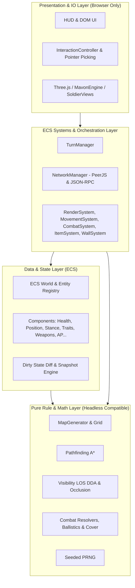

# System Architecture & Runtime Overview

## 1. Architectural Layers

The codebase is strictly layered into decoupled tiers to allow headless execution, deterministic testing, and network synchronization:

---

## 2. Directory Layout & Module Responsibilities

| Directory | Layer | Purpose & Responsibilities | Headless Safe? |
| --- | --- | --- | --- |
| `src/core/` | Core Rules | Pure math, Grid DDA, Line of Sight, Pathfinding, Ballistics, Combat formulas, RNG. | **Yes** (100% pure) |
| `src/ecs/` | State & Systems | ECS `World`, component classes, system update loops, dirty-diff state sync. | **Yes** (Pure data) |
| `src/sim/` | Simulation | Fast headless match runner (`SimUnit`, `SimMatch`, `Balance`) for automated testing. | **Yes** |
| `src/game/` | Game Logic | `TurnManager`, `NetworkManager`, `Battlefield`, `Squads`, movement/shooting planners. | Mostly (decoupling in progress) |
| `src/render/`| Presentation | Three.js meshes, animations, tracers, particles, material cloning, ground tiles. | **No** (Requires WebGL) |
| `src/hud/` | Presentation | HTML/CSS HUD overlays, loadout screen, portraits, debug panels. | **No** (Requires DOM) |
| `src/camera/`| Presentation | `OrbitRig`, camera inputs, ground raycaster picking. | **No** (Requires Canvas/DOM) |

---

## 3. Key Invariants & Contracts

1. **Pure Rules are Headless**: `src/core/` and `src/ecs/` must never import from `src/render/`, `src/hud/`, or `src/camera/`.
2. **Deterministic PRNG**: All gameplay calculations (rolls, spreads, hit checks, map seeds) use seeded PRNG from `src/core/rng.ts`. One stream per match — `matchDice(seed)` — injected into the resolvers and drawn only by the rules; presentation takes its own randomness, since a draw from the match stream moves every later roll in it. Enforced by `tests/determinism.test.ts`, which also refuses `Math.hypot` and `Math.atan2` anywhere the rules can see them: `sqrt` is correctly rounded by IEEE 754 and those two are not, and a facing is replicated and digested.
3. **Headless replay**: `src/sim/Replay.ts` (`bun run replay <file>`) refights a recorded intent stream through the real systems with no engine, no canvas and nothing watching. It is how the *receiving* side of the wire is tested without two browsers: every shot in a file arrives as a peer's does, so the divergence check and the state digest are exercised by running a match somebody already played.
4. **Intent on the wire**: a command carries what a player decided — `fireShot` is a shooter, a target and a mode — and both peers resolve it through the same rules from one seeded stream per match. No outcome travels, so no outcome can arrive wrong, and the bug class where an attacker needed facts about its target it only had a stale copy of is gone by construction. A disagreement is a desynchronisation, reported by the state digest exchanged at each handover. See [ADR-0004](../design/adr/0004-full-knowledge-lockstep.md).
5. **Component State Diffing**: Remote state synchronization occurs via `World.syncDirty()` emitting JSON-RPC delta notifications.
