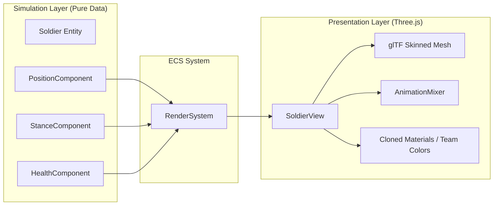

# Rendering Engine & View Pipeline

## 1. Overview & Engine Stack

The game's visual presentation runs in the browser using **Three.js** and `@mavonengine/core`:
- **Engine Context (`src/engine.ts`)**: Narrow interface providing access to `scene`, `camera`, `canvas`, and loaded `assets`.
- **RenderSystem (`src/ecs/systems/RenderSystem.ts`)**: The single ECS system responsible for bridging component state into 3D transforms, animation playback, and mesh visibility.

---

## 2. View Separation Pipeline

---

## 3. Visual Effects & Feedback Systems

- **Tracers (`src/render/Tracers.ts`)**: Fast ballistic projectile lines with variable colors and speeds.
- **Damage Indicators (`src/render/DamageIndicators.ts`)**: Floating 3D floating text indicators for hits, misses, crits, and armor shred.
- **Combat FX (`src/render/SceneCombatFx.ts`)**: Concrete implementation of the `CombatFx` port for interactive matches — tracers into the scene, and the fire and flinch poses onto the unit that earned them, resolved by identity through `SquadViews`. Deaths are *not* announced here: a corpse is `hp <= 0` in a component, so `RenderSystem` plays the collapse on observing it.
- **Ground & Grid Overlay (`src/render/Ground.ts` & `src/render/PathMarker.ts`)**: Procedurally textured terrain tiles, cover shield glyphs, and movement range boundary markers.
