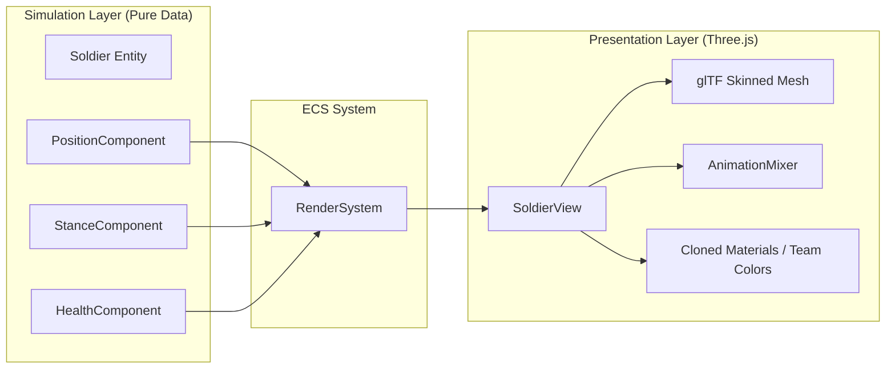

# Rendering Engine & View Pipeline

## 1. Overview & Engine Stack

The game's visual presentation runs in the browser using **Three.js** and `@mavonengine/core`:
- **Engine Context (`src/engine.ts`)**: Narrow interface providing access to `scene`, `camera`, `canvas`, and loaded `assets`.
- **RenderSystem (`src/ecs/systems/RenderSystem.ts`)**: The single ECS system responsible for bridging component state into 3D transforms, animation playback, and mesh visibility.

---

## 2. View Separation Pipeline

```mermaid
graph LR
    subgraph Data ["Simulation Layer (Pure Data)"]
        Soldier[Soldier Entity]
        Pos[PositionComponent]
        Stance[StanceComponent]
        Health[HealthComponent]
    end

    subgraph System ["ECS System"]
        RenderSys[RenderSystem]
    end

    subgraph View ["Presentation Layer (Three.js)"]
        SoldierView[SoldierView]
        Mesh[glTF Skinned Mesh]
        Mixer[AnimationMixer]
        Mats[Cloned Materials / Team Colors]
    end

    Pos --> RenderSys
    Stance --> RenderSys
    Health --> RenderSys
    RenderSys --> SoldierView
    SoldierView --> Mesh
    SoldierView --> Mixer
    SoldierView --> Mats
```

---

## 2.1 Stances, actions and overlays

A body is doing at most two things: holding a **stance** and performing an **action**.

The stance is a looping clip chosen from replicated component state — `idle`, `crouch`, `run`,
`crouchWalk`, or `aim` when a standing unit is `watching`. `RenderSystem` derives a key from
`StanceComponent` and `HealthComponent` (`idle`, `crouch`, `idle-watch`, `crouch-watch`, `move`,
`dead`) and calls `SoldierView.playStanceClip()` when it changes, so a peer's unit poses off the
same state a local one does.

An action is a one-shot: `shoot`, `hit`, `punch`, `swing`, `throw`, `reload`, `interact`. Standing,
it is played whole and the mixer's `finished` event hands control back to the stance. Crouched,
playing it whole would stand the unit up for the length of the clip and drop it back afterwards —
which is what firing from cover used to look like — because the source pack has no crouched
variant of any of them.

So crouched, an action is an **overlay**: `additiveClips()` builds, once per glTF, a copy of each
action clip with every track below the spine removed (`root`, `pelvis`, `thigh_*`, `calf_*`,
`foot_*`, `ball_*`) and the rest taken relative to the first frame of `idle`
(`AnimationUtils.makeClipAdditive`). An additive action accumulates on top of whatever the stance
is doing rather than competing with it for weight, so the crouch keeps the legs and the overlay
moves the arms. A crouched watch is the same mechanism with `aim` looping instead of firing once,
and it yields to an action and resumes when that action finishes. Death is never an overlay: a unit
that dies crouched still collapses.

`tests/animation.test.ts` asserts the invariant on the shipped asset without a browser: two bodies
holding the same crouch at the same moment, one of them firing, must have their feet and pelvis in
the same place and their gun hands in different ones.

---

## 3. Visual Effects & Feedback Systems

- **Tracers (`src/render/Tracers.ts`)**: Fast ballistic projectile lines with variable colors and speeds.
- **Damage Indicators (`src/render/DamageIndicators.ts`)**: Floating 3D floating text indicators for hits, misses, crits, and armor shred.
- **Combat FX (`src/render/SceneCombatFx.ts`)**: Concrete implementation of the `CombatFx` port for interactive matches — tracers into the scene, and the fire, flinch, blow, throw and reload poses onto the unit that earned them, resolved by identity through `SquadViews`. Deaths are *not* announced here: a corpse is `hp <= 0` in a component, so `RenderSystem` plays the collapse on observing it. Two verbs announce through their own system's hook instead of the port, because neither is combat: item use through `ItemSystem.onItemUsed`, and a door through `CommandSystem.onDoorWorked` (fired before the shoulder is rolled, so a force that holds is still a shove). Both play `interact`.
- **Ground & Grid Overlay (`src/render/Ground.ts` & `src/render/PathMarker.ts`)**: One plane for the ground floor, coloured per tile by what it is made of (`uSurface`, from `core/Surfaces`), with fog and a per-tile overlay on top; raised floors take the same per-tile colour as instances in `Blocks`. Cover shield glyphs and movement range markers. The tile under the pointer is spelled out in the HUD's tile readout (`tileReadout`).

---

## 4. HUD, Menus & Screens (DOM, React)

Everything drawn over or instead of the canvas — the in-match HUD, the menus and lobby, the
roster and loadout screens, playback controls, the debug map and panel — is **React 19**
components in `.tsx` files under `src/hud/` (`src/hud/menu/` for the menus, `src/hud/hud/` for
the in-match HUD's parts), compiled by Bun with no extra tooling (`jsx: react-jsx`).

- **Model in, markup out.** `HudModel.ts` stays a pure function of the match state
  (`buildHudModel`, `endScreens`, `tileReadout`) and knows nothing of React; components read it.
- **Each surface's class owns a root.** `Hud`, `LoadoutScreen`, `RosterScreen`,
  `PlaybackControls`, `FullscreenPrompt`, `DebugMap` and `DebugPanel` keep the imperative API
  their callers use (`render(model)`, `showEndScreen`, `refresh`…): each creates its container,
  holds a `createRoot`, and re-renders on every call. `main.ts` does the same for the menus.
  So `InteractionController` and `main.ts` drive the UI as before, and React only decides what
  in the DOM to change.
- **Why React.** Every surface used to be a string template assigned to `innerHTML`, which threw
  the old elements away on each update: a scrolled panel jumped to the top, a button replaced
  under a press lost the click (the turn overlay was kept out of the 30 Hz redraw for exactly
  that), focus and hover reset, and UI state had to live outside the markup to survive.
  Reconciliation keeps elements that did not change, so none of that needs code any more. JSX
  also escapes every interpolated value, and intents are `onClick` closures rather than JSON in
  `data-*` attributes (`ITEM-055`).
- **CSS is unchanged in kind.** `src/game.css` styles the components by the class names the
  templates used; icons are `<Icon file="…" />` (`src/hud/Icon.tsx`), the masked game-icons.net
  glyph.
- **Not React:** Tweakpane's panels inside `DebugPanel`, the frame counter's per-frame text
  (`FpsCounter`), the page-corner containers (`CornerStack`) and the Three.js canvas.
- **Tests** that need a DOM register happy-dom for their own file only
  (`@happy-dom/global-registrator`, registered in `beforeAll`, unregistered in `afterAll`):
  `bun test` runs every file in one process, and the headless suites must never see a
  `document`.
