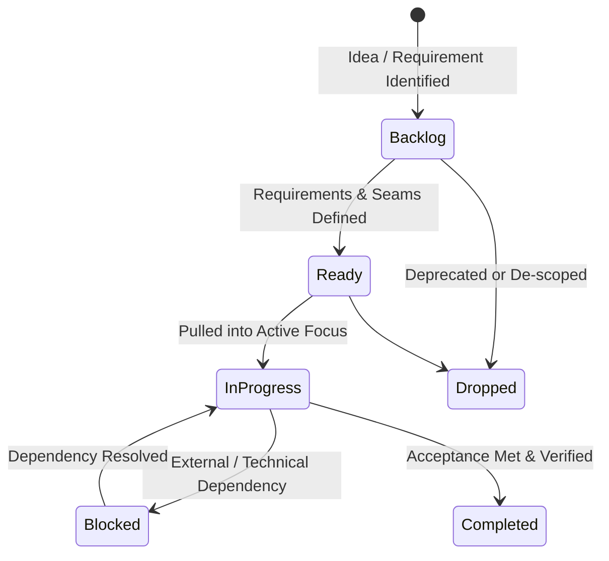

# Engineering & Product Backlog

## Backlog Taxonomy & Kanban Workflow

Items in the backlog follow a pull-based Kanban flow:

### Document Map
- [Active Backlog](./active-backlog.md): Prioritized, actionable items ready for or currently in execution.
- [Active Focus Board](../plans/active-focus.md): Current work-in-progress and immediate pull queue.
- [Completed Archive](./completed.md): Historical record of delivered work, verification notes, and retrospective learnings.

### Item ID Convention
- `ARCH-xxx`: Architectural and core structural changes.
- `ENG-xxx`: Systems, ECS, networking, performance, rendering engine work.
- `GAME-xxx`: Gameplay mechanics, combat rules, items, RPG traits, balance.
- `UI-xxx`: HUD, screens, visual design, sound, controls.
