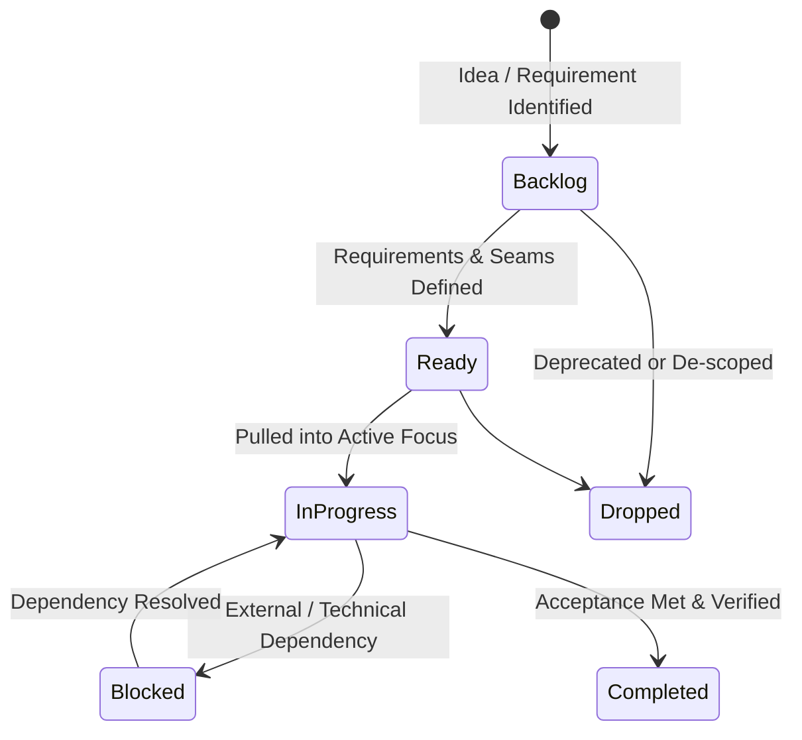

# Engineering & Product Backlog

## Backlog Taxonomy & Kanban Workflow

Items in the backlog follow a pull-based Kanban flow:

### Document Map
- [Active Backlog](./active-backlog.md): Prioritized, actionable items ready for or currently in execution.
- [Active Focus Board](../plans/active-focus.md): Current work-in-progress and immediate pull queue.
- [Completed Archive](./completed.md): Historical record of delivered work, verification notes, and retrospective learnings.

### Item ID Convention
All work items follow a single, unified sequential key:
- `ITEM-001`, `ITEM-002`, `ITEM-003`, ... across all categories (architecture, features, balance, refactoring, UI).
