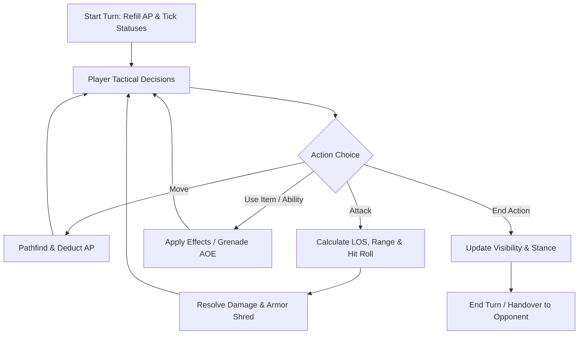

# GDD: Tactical Combat Mechanics

## 1. Core Combat Loop

Combat is turn-based on a discrete grid. Units execute movements, attacks, stance changes, and item usages powered by Action Points (AP).

---

## 2. Key Pillars

### 2.1 Action Points (AP) & Movement
- Allocation is per character, not per side: each soldier rolls its own ceiling, and traits
  move it further. See the [catalogue](status-and-trait-catalog.md) for the current range.
- Movement cost is the terrain's price scaled by the unit's condition, so the same route costs
  a limping soldier more. Routes are planned in terrain points and the *budget* is divided, so
  a confirmed route can never strand a unit halfway.
- Spending every point on consecutive turns leaves the unit `Winded` — a status, temporary,
  which ticks away. Ending a turn early is not effort: forfeiting hands a unit nothing
  remaining without it having run anywhere.

### 2.2 Line of Sight (LOS) & Fog of War
- Fast DDA (Digital Differential Analyzer) ray marching across grid tiles.
- Dynamic occlusion from terrain walls, obstacles, and smoke grenades.
- **Firing reveals.** A unit that has fired is seen for the rest of the round whatever the line
  of sight says, which is what a suppressor buys out of.
- **Intel fog**: an opponent's sheet is unread until it has fired on you or you have shot at
  it, and reading it is permanent. What is withheld is the *attribution* — the hit chance
  stays honest, because a number a player can act on must not be a guess. Observable state
  (health, armour) is never hidden: you can see that a soldier is hurt.

### 2.3 Weapons, Rails & Kit
- A weapon is a **thing, not a kind of thing**: it has a serial, and its fitted kit belongs
  to it. Handing it to another soldier takes the glass along; pocket kit stays behind.
- **Rail space depends on the class.** A service rifle is built as a platform; a hunting
  shotgun has a bead and a barrel. Counts in the
  [catalogue](status-and-trait-catalog.md).
- A rail refuses a duplicate as well as an overflow, and swapping to a weapon with fewer
  slots trims what no longer fits back into the crate.

### 2.4 Cover & Stances
- Cover is an accuracy penalty on the shot rather than an evasion bonus on the target, and it
  depends on stance as well as on what is being hidden behind: crouching in the open is worth
  something, crouching behind a wall a great deal. Values in `COVER`
  (`docs/architecture/combat-and-rules.md`).
- **Stances**: standing (ordinary mobility) versus crouched (cover is worth more, and some kit
  — the bipod — pays only while down).

### 2.5 Ballistics, Armor, and Wounds
- **Hit roll**: the shooter's training with the weapon in hand against the target's evasion,
  less range, cover and statuses, all scaled by the shot mode.
- **Armor & shred**: armour subtracts flat from each round, but only the share the round fails
  to penetrate, and every hit does at least a minimum. AP rounds and explosives shred it
  permanently.
- **Wounds**: `Limping` below half health, `Concussed` below a quarter — derived from current
  health, so patching a soldier up lifts them. `Winded` is exhaustion, not a wound.
