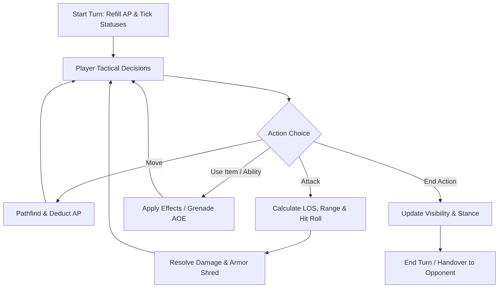

# GDD: Tactical Combat Mechanics

## 1. Core Combat Loop

Combat is turn-based on a discrete grid. Units execute movements, attacks, stance changes, and item usages powered by Action Points (AP).

---

## 2. Key Pillars

### 2.1 Action Points (AP) & Movement
- Standard allocation: 10 AP per turn (modified by traits and wounds).
- Movement cost calculated dynamically across terrain and elevation changes.
- Sprinting / high expenditures consecutive turns trigger fatigue/exhaustion (`Winded`).

### 2.2 Line of Sight (LOS) & Fog of War
- Fast DDA (Digital Differential Analyzer) ray marching across grid tiles.
- Dynamic occlusion from terrain walls, obstacles, and smoke grenades.
- Intel Fog: Opposing unit stats remain obfuscated until scouted or engaged.

### 2.3 Cover & Stances
- **Half Cover**: Provides defensive evasion bonus (+15%).
- **Full Cover**: Substantial evasion bonus (+30%) and high occlusion.
- **Stances**: Standing (standard mobility) vs Crouched (evasion bonus, reduced mobility).

### 2.4 Ballistics, Armor, and Wounds
- **Hit Roll**: Derived from Shooter Proficiency vs Target Evasion and Range Band.
- **Armor & Shred**: Armor directly absorbs incoming damage; specialized munitions (e.g. AP ammo, Frag grenades) permanently shred armor.
- **Wounds as Negative Traits**: Dropping below 50% and 25% health applies lasting debilitating traits (`Winded`, `Concussed`, `Limping`).
