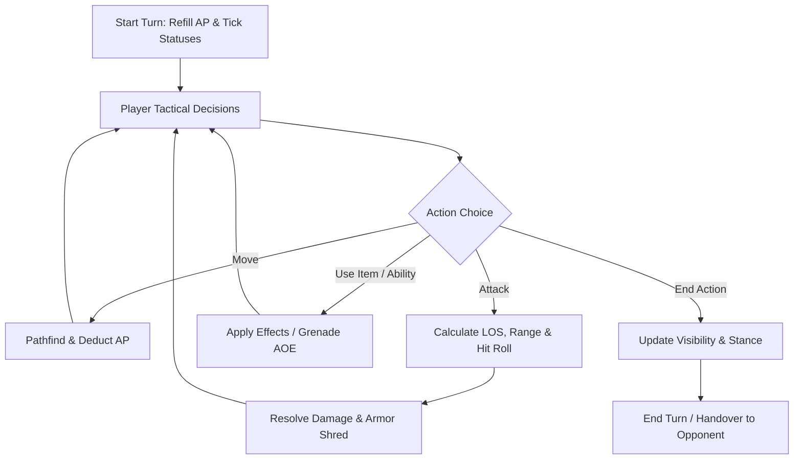

# GDD: Tactical Combat Mechanics

## 1. Core Combat Loop

Combat is turn-based on a discrete grid. Units execute movements, attacks, stance changes, and item usages powered by Action Points (AP).

```mermaid
graph TD
    A[Start Turn: Refill AP & Tick Statuses] --> B[Player Tactical Decisions]
    B --> C{Action Choice}
    C -->|Move| D[Pathfind & Deduct AP]
    C -->|Attack| E[Calculate LOS, Range & Hit Roll]
    C -->|Use Item / Ability| F[Apply Effects / Grenade AOE]
    C -->|End Action| G[Update Visibility & Stance]
    D --> B
    E --> H[Resolve Damage & Armor Shred]
    H --> B
    F --> B
    G --> I[End Turn / Handover to Opponent]
```

---

## 2. Key Pillars

### 2.1 Action Points (AP) & Movement
- Allocation is per character, not per side: each soldier rolls its own ceiling, and traits
  move it further. See the [catalogue](status-and-trait-catalog.md) for the current range.
- Movement cost is the terrain's price scaled by the unit's condition, so the same route costs
  a limping soldier more. Routes are planned in terrain points and the *budget* is divided, so
  a confirmed route can never strand a unit halfway.
- Spending every point on consecutive turns leaves the unit `Winded` — a status, temporary,
  which ticks away. Ending a turn early is not effort: forfeiting hands a unit nothing
  remaining without it having run anywhere.
- **Heavy gear costs a point.** Body plate is worth wearing and is not free: the weight takes
  both speed and one of the turn's action points. A strong enough soldier carries it for
  nothing — broad shoulders answer the weight, not the bulk, so plate still makes its wearer
  easier to hit however strong they are. Who wears the heavy kit is therefore a decision about
  the squad rather than a flat upgrade for whoever has a free slot.

### 2.2 Line of Sight (LOS) & Fog of War
- Fast DDA (Digital Differential Analyzer) ray marching across grid tiles.
- Dynamic occlusion from terrain walls, obstacles, and smoke grenades.
- **Firing reveals.** A unit that has fired is seen for the rest of the round whatever the line
  of sight says, which is what a suppressor buys out of.
- **Intel fog**: an opponent's sheet is unread until it has fired on you or you have shot at
  it, and reading it is permanent. What is withheld is the *attribution* — the hit chance
  stays honest, because a number a player can act on must not be a guess. Observable state
  (health, armour) is never hidden: you can see that a soldier is hurt.
- Both halves of the reveal have a counter, and they are deliberately different things. A
  **suppressor** hides what a unit *does* — firing no longer announces it. **Inscrutable**
  hides what a unit *is* — being shot at teaches the shooter nothing. A soldier with both is
  legible only by where they are standing.

### 2.3 Weapons, Rails & Kit
- A weapon is a **thing, not a kind of thing**: it has a serial, and its fitted kit belongs
  to it. Handing it to another soldier takes the glass along; pocket kit stays behind.
- **Rail space depends on the class.** A service rifle is built as a platform; a hunting
  shotgun has a bead and a barrel. Counts in the
  [catalogue](status-and-trait-catalog.md).
- A rail refuses a duplicate as well as an overflow, and swapping to a weapon with fewer
  slots trims what no longer fits back into the crate.
- **A weapon fires straight lines.** A rifle round is one line; a shotgun shell is nine, each
  wide. What separates the classes is how steady a line is in the hands, how fast its error
  grows with distance, and how many lines a round is — so a shotgun is the hardest-hitting
  thing in a room and nearly useless across a street, with no rule saying so. The player sees
  a chance and a damage figure; the weapon's character is on the loadout screen.

### 2.4 Cover & Stances
- Cover hides body rather than subtracting points: it depends on stance as well as on what is
  being hidden behind — crouching in the open shows half a soldier, crouching behind a wall
  barely any. Values in `COVER` (`docs/architecture/combat-and-rules.md`).
- **Stances**: standing (ordinary mobility) versus crouched (cover is worth more, and some kit
  — the bipod — pays only while down). Crouching costs `RULES.coverApCost` and standing is free.
  **A crouched unit moves crouched**: every step costs `RULES.crouchStepCost` (1.5) times its
  standing price, at a slower walk, and it arrives still down. Moving used to stand a unit up,
  so crouching was something done between moves and never while making one; it is now the
  quiet way to cross ground ([Noise & Stealth](noise-and-stealth.md) will price the difference).
- **Overwatch.** A unit may go on watch for a snap shot's price, paid at once. The first time an
  enemy *arrives* on a tile it can shoot at during the other side's turn, it fires a reaction
  shot (its aim 1.4× as wide as a snap shot's) and stops watching. The shot itself costs
  nothing more — it was bought when the watch was set — and a watch that nobody walks into is
  simply spent, which is what keeps it from being strictly better than ending a turn. A watch
  ends when its own side's turn comes round. This is the counter to crossing open ground:
  walking the whole way past a rifle costs more than stepping once into its lane, because the
  trigger is each tile, not the route.

### 2.5 Ballistics, Armor, and Wounds
- **Hit roll**: each projectile lands with a probability set by its error at that distance
  against how much of the target is showing — training and aimed fire tighten the error;
  snap, reaction, suppression and being flashed widen it; cover, crouching and evasion hide body.
- **Armor & shred**: armour subtracts flat from each round — once, from whatever of it landed,
  so buckshot is impact rather than penetration — and only the share the round fails to
  penetrate. Every round that lands does at least a minimum. AP rounds and explosives shred it
  permanently.
- **Wounds**: `Limping` below half health, `Concussed` below a quarter — derived from current
  health, so patching a soldier up lifts them. `Winded` is exhaustion, not a wound.
- **Bleeding** (ITEM-036): any round or blow that lands may open a wound that bleeds, rolled
  once per round like a critical and just as weapon-dependent — a knife or a sniper round most
  often, buckshot often, a rifle sometimes, each round of a Gatling rarely, a club seldom, fists
  never. Plate a round does not go through lowers the odds as it lowers a crit's. A bleeding
  unit loses a few hit points at the start of each of its own turns, per wound, up to three;
  armour does nothing for it. It clots after three of its turns, or a first aid kit stops it.
  Some people never bleed: the **Hardy** (a trait one can be born with) and anyone in a
  **Nullweave** vest, which already keeps a round from finding a vital.

### 2.6 Field Work: Treating, Repairing and Technical Kit
- **A medic can work on somebody else.** Kit that treats a body or a plate can be used on a
  squadmate within arm's reach instead of on yourself: pick the row, pick who gets it, confirm
  — two taps, so choosing wrongly costs nothing, and the soldier in the worst shape nearby is
  pre-picked for the common case. The turn's cost and the item itself always come out of the
  *user's* pouch.
- **Medical training only pays out on other people.** A soldier trained in medicine restores
  noticeably more when treating a squadmate; nobody gets credit for bandaging their own arm.
  How well treatment takes also depends on the *patient's* constitution, so a tough soldier is
  a better patient than a frail one.
- **A first aid kit also stops a bleed** — and any other *ailment*, a condition that gets worse
  on its own. Bleeding is the first; poison, when it comes, will be treated by the same kit
  with nothing new to learn.
- **A repair kit patches armour** — the only thing in the game that undoes permanent loss, so
  a squad that has been shredded has an answer other than dying with bare plates. It is slower
  and gives back less than a first aid kit gives in health, because armour only blunts what
  lands rather than being a second life bar.
- **Technical kit has to be understood to be used.** The repair kit needs a certain
  Intelligence; a soldier below it carries it as dead weight, and the loadout screen and the
  action row both say so rather than leaving a dead button. Roughly the clever half of a squad
  can work one, which makes bringing it a decision about who is carrying it.
- **Training in mechanics cuts both ways**, as all training does: a trained mechanic repairs
  more armour and spends less of the turn doing it, while somebody untrained fumbles the job
  and pays more for less.
- **Explosives are trained too.** A soldier schooled in demolitions gets a wider blast and
  strips more armour out of the same grenade — it is the charge that is better set, not the
  arm, so throwing distance stays a matter of strength.

### 2.7 Extensions: built, and still proposed

Design drafts that extend the pillars above. Each says what exists in the code and what is
still a plan, so a reader can tell a plan from a rule.

- [Melee Combat](melee-combat.md) — **built**: a sidearm slot with fists, knife and club,
  and attacks from behind (see
  [Combat & Rules](../../architecture/combat-and-rules.md#melee-a-blow-with-the-sidearm)).
  Non-lethal takedowns wait for the campaign roster.
- [Noise & Stealth](noise-and-stealth.md) — **built**: crouched movement, loudness per action
  heard against each listener's ears, awareness (unaware, alerted, engaged), breakable glass
  and the thrown stone. Open: the sweep's AI neither sneaks nor throws.
- [Morale](progression-and-meta.md#3-morale-stress--predispositions) — **built**: stress, a
  rolled break into panic, frenzy or freeze, rolled steadying, temperament and the three
  predispositions. Surges are a proposal.
- [Interaction & Environment](interaction-and-environment.md) — **proposed**: the item verb
  pointed at tiles and objects as well as people — keys and locks, doors, fire.
- [Retreat](#28-retreat) — **built**: getting out of a fight alive by reaching your own edge
  (`ITEM-051`), and an AI that knows it can, to a standing order (`ITEM-052`). Capture of the
  left-behind is an idea (`ITEM-054`).

### 2.8 Retreat

**Status: built** (`ITEM-051` rules and the player's command, `ITEM-052` the AI; the rules are
in [Combat & Rules](../../architecture/combat-and-rules.md#retreat)). A fight used to end only
when one side had nobody left standing. Retreat is the second way out, and the main thing
standing between a squad and an unwinnable fight, whether the player is watching it or not
([World & Travel](world-and-travel.md) §5.3).

- **Your edge is where you came in.** Each side deploys along its own edge of the map; the
  rows it deployed in, across the full width of the map, are its way out. A squad is standing
  on its way out when a fight begins, so getting out at once is always possible to try.
- **Retreat is called for the whole side**, on its own turn. Everyone standing on the side's
  edge goes. Anyone who is not is **left behind**, and for now a character left behind is lost:
  dead to the roster, the same as one killed. (Being captured instead, and rescued later, is a
  later idea, `ITEM-054`.) At least one has to be on the edge to call it.
- **It is rolled, and it can fail.** The chance rises with the side's morale and health and
  falls for every enemy that can see somebody trying to leave. A failed attempt ends the turn.
  The roll is a rule, so it comes from the match's own dice and both sides see the same result.
- **Getting away ends the fight.** The side that stays holds the field and wins as if the fight
  had been fought out, survivors growing as usual. Those who got away **keep their wounds and
  what they learned**: the experience they earned in the fight still grows them. Nobody is
  carried out, because nobody needs to be.
- **Panic runs for home.** A panicking soldier already runs from what it can see; it now runs
  toward its own edge, so a squad that breaks drifts toward the way out, and a skittish soldier
  can end up standing on it.
- **The AI knows it can retreat** (`ITEM-052`). It fights to one of four standing orders:
  stand and fight; fight but pull out after the first wound or death; size the enemy up first and
  then decide; or avoid the fight and pull out at once. It decides from what its side has seen,
  never from what it could not know.

Retreat sits between losing everything and winning: those who get out live and keep what they
learned, and the field and the win go to the other side.
