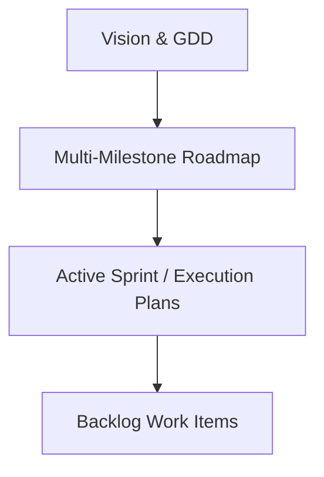

# Planning & Roadmaps Overview

## Planning Hierarchy

- **[Milestone Roadmap](./roadmap.md)**: High-level architectural and gameplay milestones (M1 to M4).
- **[Active Sprint Plan](./sprints/sprint-current.md)**: Current execution plan, sprint goals, and task sequence.
