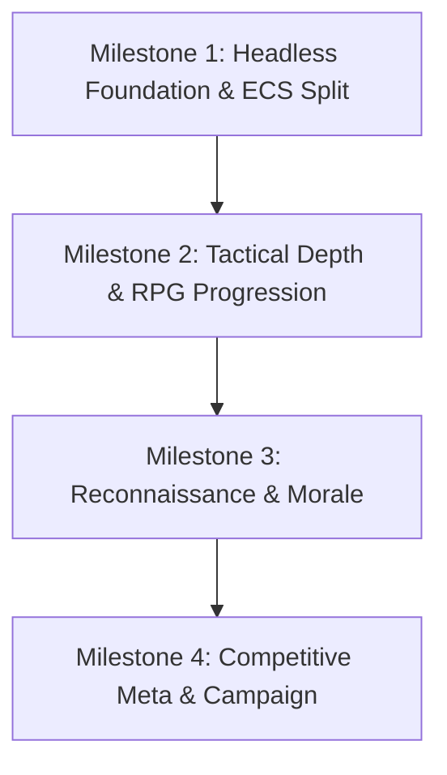

# Multi-Milestone Capability Roadmap

Milestones are ordered strictly by architectural dependency:

---

## Milestone Sequence

### Milestone 1: Headless Foundation & ECS Split
**Status:** In Progress  
**Focus:** Complete separation of game rules from rendering.
- Narrow ports (`Combatant`, `CombatFx`). *(Completed)*
- Deterministic balance simulation runner. *(Completed)*
- `Soldier` as pure data unit; `SoldierView` owning Three.js meshes and animation mixers.
- Elimination of canvas stubs across test suites.

---

### Milestone 2: Tactical Depth & RPG Progression
**Status:** Planned  
**Focus:** Character growth and mechanical stakes during combat.
- In-match XP accrual and on-the-fly 3-perk promotion draft (`[GAME-001]`).
- Lasting wound debuffs when crossing <50% and <25% HP thresholds (`[GAME-002]`).
- Trait-bearing passive equipment: scopes, bipods, suppressors, plate carriers (`[GAME-003]`).

---

### Milestone 3: Reconnaissance & Morale
**Status:** Planned  
**Focus:** Information asymmetry and battlefield control.
- Enemy intel fog hiding opposing character stat numbers until engaged (`[GAME-004]`).
- Ballistic suppression mechanics applying accuracy debuffs on near-misses (`[GAME-005]`).
- AP fatigue penalty for consecutive maximum-movement turns (`[GAME-006]`).

---

### Milestone 4: Competitive Meta & Campaign
**Status:** Planned  
**Focus:** High-level tactics, team composition, and long-term roster persistence.
- Tactical role specializations on loadout screen (Medic, Scout, Marksman, Gunner) (`[UI-001]`).
- Reaction fire and overwatch interleaving inside enemy movement paths (`[GAME-007]`).
- LocalStorage and P2P campaign roster persistence across matches (`[GAME-008]`).
