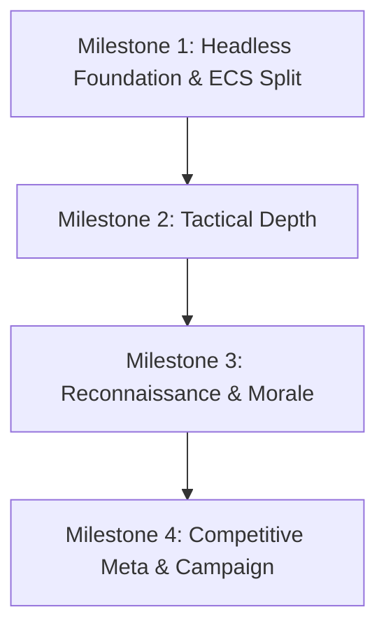

# Multi-Milestone Capability Roadmap

Milestones are ordered strictly by architectural dependency:

---

## Milestone Sequence

### Milestone 1: Headless Foundation & ECS Split
**Status:** Complete  
**Focus:** Complete separation of game rules from rendering.
- Done: `[ITEM-001]` narrow ports, `[ITEM-002]` balance harness, `[ITEM-003]` data units vs view
  units, `[ITEM-030]` one engine for sweep and play, `[ITEM-031]` one command applier.
- Canvas stubs stay in the suites that draw textures; removing them was tried and struck (see
  `ITEM-003` in the archive).

---

### Milestone 2: Tactical Depth
**Status:** Complete  
**Focus:** Mechanical stakes during combat.
- Done: `[ITEM-005]` wounds, `[ITEM-006]` weapon rails and worn kit, `[ITEM-013]`/`[ITEM-015]`/
  `[ITEM-016]` attributes at work, `[ITEM-018]` melee, `[ITEM-020]`–`[ITEM-023]` full-knowledge
  lockstep, `[ITEM-032]` projectile hit model, `[ITEM-034]` tile properties, fire and smoke.
- Done last: `[ITEM-017]` doors, locks and keys (2026-09-25).
- After-match progression (`[ITEM-004]`) moved to M4, where its payoff (a roster that keeps it) is.

---

### Milestone 3: Reconnaissance & Morale
**Status:** Complete  
**Focus:** Information asymmetry and battlefield control.
- Done: `[ITEM-007]` intel fog, `[ITEM-008]` suppression, `[ITEM-009]` exhaustion, `[ITEM-029]`
  covered-ground AI, `[ITEM-019]` noise and awareness, `[ITEM-014]` morale, `[ITEM-033]`
  character.

---

### Milestone 4: Competitive Meta & Campaign
**Status:** In Progress  
**Focus:** High-level tactics, team composition, and long-term roster persistence.
- Done: `[ITEM-011]` overwatch, `[ITEM-024]` transport port, `[ITEM-025]` referee.
- Open, in the order on the [focus board](./active-focus.md): `[ITEM-004]` after-match
  progression and the end screen (in progress), `[ITEM-028]` schema drift guard with
  `[ITEM-012]` roster persistence, `[ITEM-010]` roles.
