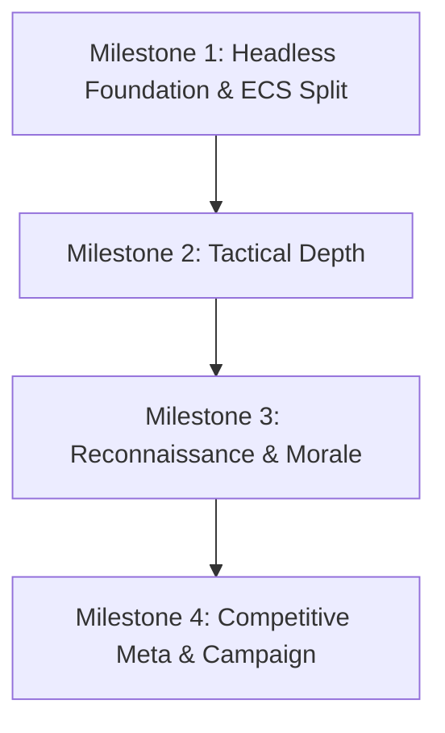

# Multi-Milestone Capability Roadmap

Milestones are ordered strictly by architectural dependency:

```mermaid
graph TD
    M1[Milestone 1: Headless Foundation & ECS Split] --> M2[Milestone 2: Tactical Depth]
    M2 --> M3[Milestone 3: Reconnaissance & Morale]
    M3 --> M4[Milestone 4: Competitive Meta & Campaign]
```

---

## Milestone Sequence

### Milestone 1: Headless Foundation & ECS Split
**Status:** Complete  
**Focus:** Complete separation of game rules from rendering.
- Done: `[ITEM-001]` narrow ports, `[ITEM-002]` balance harness, `[ITEM-003]` data units vs view
  units, `[ITEM-030]` one engine for sweep and play, `[ITEM-031]` one command applier.
- Canvas stubs stay in the suites that draw textures; removing them was tried and struck (see
  `ITEM-003` in the archive).

---

### Milestone 2: Tactical Depth
**Status:** Complete  
**Focus:** Mechanical stakes during combat.
- Done: `[ITEM-005]` wounds, `[ITEM-006]` weapon rails and worn kit, `[ITEM-013]`/`[ITEM-015]`/
  `[ITEM-016]` attributes at work, `[ITEM-018]` melee, `[ITEM-020]`–`[ITEM-023]` full-knowledge
  lockstep, `[ITEM-032]` projectile hit model, `[ITEM-034]` tile properties, fire and smoke.
- Done last: `[ITEM-017]` doors, locks and keys (2026-09-25).
- After-match progression (`[ITEM-004]`) moved to M4, where its payoff (a roster that keeps it) is.

---

### Milestone 3: Reconnaissance & Morale
**Status:** Complete  
**Focus:** Information asymmetry and battlefield control.
- Done: `[ITEM-007]` intel fog, `[ITEM-008]` suppression, `[ITEM-009]` exhaustion, `[ITEM-029]`
  covered-ground AI, `[ITEM-019]` noise and awareness, `[ITEM-014]` morale, `[ITEM-033]`
  character.

---

### Milestone 4: Competitive Meta & Campaign
**Status:** Complete  
**Focus:** High-level tactics, team composition, and long-term roster persistence.
- Done: `[ITEM-011]` overwatch, `[ITEM-024]` transport port, `[ITEM-025]` referee, `[ITEM-004]`
  after-match progression and the end screen, `[ITEM-012]` roster persistence, `[ITEM-028]`
  schema drift guard, `[ITEM-038]` lasting wounds (HP, healing, combat log), `[ITEM-010]`
  roles, `[ITEM-037]` recruit refill, `[ITEM-041]` short-handed deployment, `[ITEM-043]` one
  deployment record per soldier, `[ITEM-042]` the bench (a roster of six, pick who deploys),
  `[ITEM-044]` a live match sending its own squad's id and fatigue (`Squads.deploymentsOf`
  had dropped both), `[ITEM-039]` fatigue and medical-bay downtime.
- Done last: `[ITEM-039]` (2026-09-30), the last item this milestone named.

---

### Unscheduled: Infrastructure
Cross-cutting work that is not a milestone deliverable — nothing in the mermaid dependency
chain above depends on it, and no milestone's Definition of Done names it.
- Completed (2026-10-01): `[ITEM-045]` Cloudflare Durable Object deployment — a single DO runs
  the real referee (`Referee`, `Persistence`, `apiHandler`) over its own `Db` adapter, deployed
  for real at `https://tictac-match-server.waldemar-reusch.workers.dev`, alongside the existing
  Bun process as an additional hosting option for a match server. GitHub Pages remains the
  default way the client itself deploys either way. See
  [ARCH-DEPLOYMENT](../architecture/deployment.md) and the [archive](../backlog/completed.md).
- Backlog, not yet startable: `[ITEM-046]` Region-sharded Durable Objects — the plan
  ([RFC-0002](../design/rfc/0002-region-sharded-durable-objects.md)) for replacing `[ITEM-045]`'s
  single instance once the shared world exists and needs more than one Durable Object to hold
  it. Gated on the shared world itself, which no milestone above has built yet.

