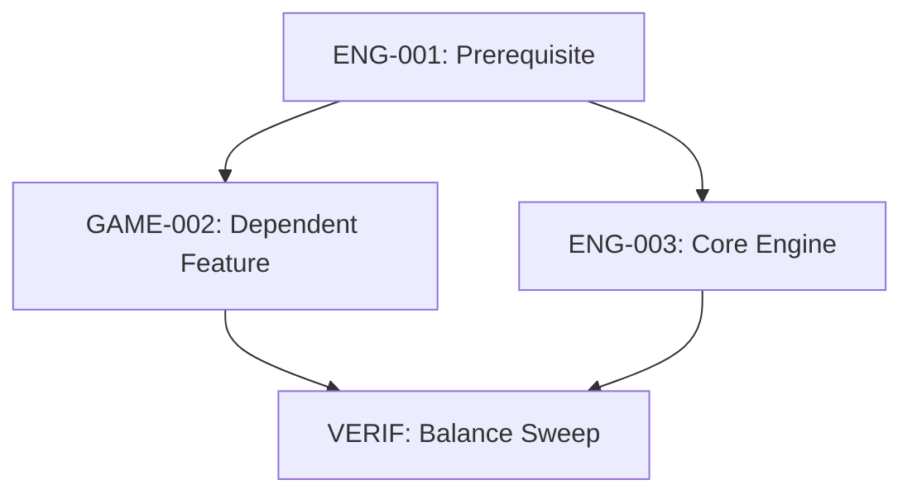

# Plan Template: Milestone / Feature Execution Plan

## Metadata
- **Plan ID:** `PLAN-[MILESTONE-OR-FEATURE-NAME]`
- **Target Milestone:** e.g., `M1 — Headless Foundation` / `Feature: In-Match Progression`
- **Theme / Goal:** One sentence defining the primary objective.
- **Status:** Planning | Active | Completed | Suspended

## Scope & Objective
What this capability delivers end-to-end.

### Success Criteria (Definition of Done)
1. Observable capability or structural state achieved.
2. Automated test suite status (`bun test`).
3. Balance report expectations (`bun run balance`).

## Kanban Focus Items
| Item ID | Title | Type | Priority | Status | Owner |
| --- | --- | --- | --- | --- | --- |
| `ENG-001` | Sample Title | Refactor | P0 | Ready | Name |
| `GAME-002`| Sample Feature | Feature | P1 | Backlog | Name |

## Execution Sequence & Dependencies

## Risks & Contingencies
| Risk | Impact | Mitigation Strategy |
| --- | --- | --- |
| Regression in animation yaw | High | Browser visual verification script |
| Desync over P2P network | Critical | Local 2-instance loopback test harness |

## Retrospective & Verification Notes
*(To be completed when milestone is achieved)*
- **Delivered Items:**
- **Dropped / Deferred Items:**
- **Learnings & Follow-ups:**
