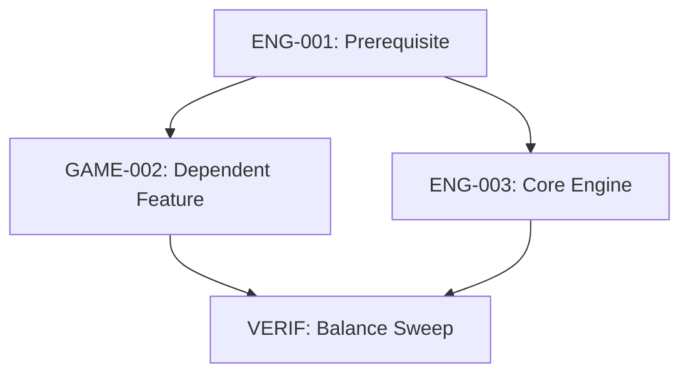

# Plan Template: Milestone / Sprint / Execution Plan

## Metadata
- **Plan ID:** `PLAN-YYYY-MM-[NAME]`
- **Target Horizon:** e.g., `2026-Q3` / `Sprint 14`
- **Theme / Goal:** One sentence defining the primary objective.
- **Status:** Planning | Active | Completed | Suspended

## Scope & Objective
What this execution cycle delivers end-to-end.

### Success Criteria (Definition of Done)
1. Observable capability or structural state achieved.
2. Automated test suite status (`bun test`).
3. Balance report expectations (`bun run balance`).

## Planned Work Items
| Item ID | Title | Type | Priority | Status | Owner |
| --- | --- | --- | --- | --- | --- |
| `ENG-001` | Sample Title | Refactor | P1 | Ready | Name |
| `GAME-002`| Sample Feature | Feature | P2 | Backlog | Name |

## Execution Sequence & Dependencies

## Risks & Contingencies
| Risk | Likelihood | Impact | Mitigation Strategy |
| --- | --- | --- | --- |
| Regression in animation yaw | Med | High | Browser visual verification script |
| Desync over P2P network | Low | Critical | Local 2-instance loopback test harness |

## Retrospective & Verification Notes
*(To be completed at milestone closing)*
- **Delivered Items:**
- **Dropped / Deferred Items:**
- **Learnings & Follow-ups:**
